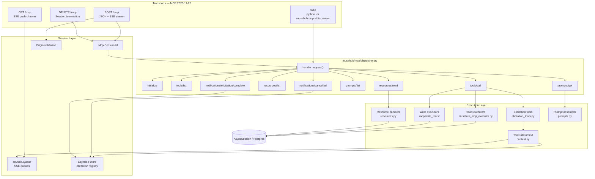
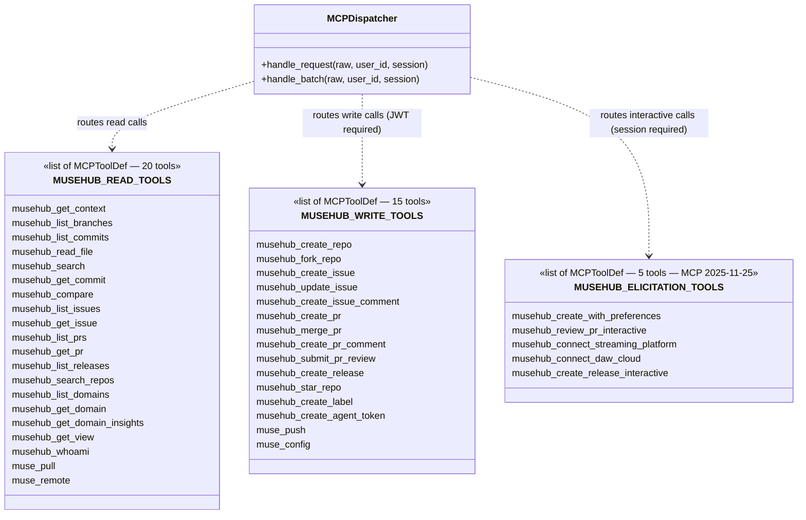
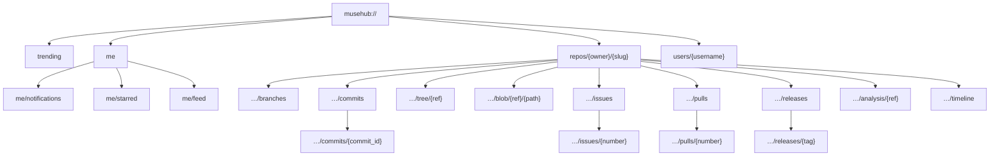
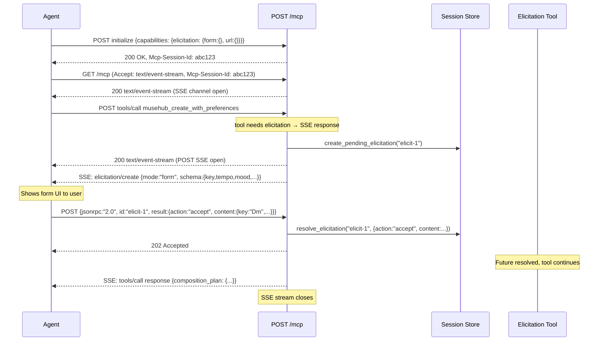
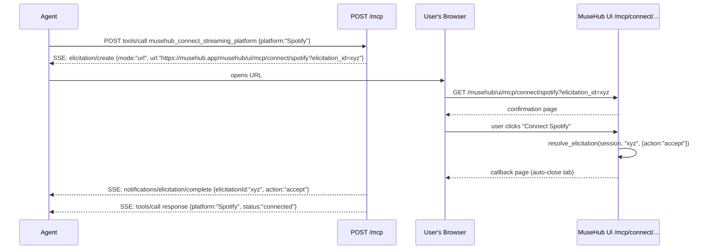

# MuseHub MCP Reference

> Protocol version: **2025-11-25** | Implementation: pure-Python async, no external MCP SDK

MuseHub treats AI agents as first-class citizens. The MCP integration gives agents complete capability parity with the web UI: they can browse, search, compose, review, and publish — over a standard protocol that every major agent runtime supports.

MCP 2025-11-25 adds the full **Streamable HTTP transport** (`GET /mcp` SSE push channel, session management, Origin security) and **Elicitation** (server-initiated user input via form and URL modes), enabling real-time interactive tool calls that interview users mid-execution.

---

## Table of Contents

1. [Architecture](#architecture)
2. [Transports](#transports)
3. [Authentication](#authentication)
4. [Session Management](#session-management)
5. [Elicitation](#elicitation)
6. [Tools — 40 total](#tools)
   - [Read Tools (20)](#read-tools-20)
   - [Write Tools (15)](#write-tools-15)
   - [Elicitation-Powered Tools (5)](#elicitation-powered-tools-5)
7. [Resources — 29 total](#resources)
   - [Static Resources (12)](#static-resources-12)
   - [Templated Resources (17)](#templated-resources-17)
8. [Prompts — 10 total](#prompts)
9. [Error Handling](#error-handling)
10. [Usage Patterns](#usage-patterns)
11. [Architecture Diagrams](#architecture-diagrams)

---

## Architecture

```
MCP Client (Cursor, Claude Desktop, any SDK)
        │
        ├─ HTTP  POST /mcp   (all client→server)
        ├─ HTTP  GET  /mcp   (SSE push, server→client)
        ├─ HTTP  DELETE /mcp (session termination)
        └─ stdio python -m musehub.mcp.stdio_server  (local dev)
                │
        musehub/api/routes/mcp.py   ← Streamable HTTP transport (2025-11-25)
                │
        musehub/mcp/dispatcher.py   ← async JSON-RPC 2.0 engine
                │
        ┌───────┼───────────────┬────────────────┐
        │       │               │                │
   tools/call  resources/read  prompts/get   notifications/*
        │       │               │                │
   Read executors   Resource handlers   Prompt   Session/Elicitation
   (musehub_mcp_executor.py)  (resources.py)  assembler  (session.py)
   Write executors                                        (context.py)
   Elicitation tools
   (mcp/write_tools/elicitation_tools.py)
        │
   AsyncSession → Postgres
```

The dispatcher speaks JSON-RPC 2.0 directly. The HTTP envelope is always `200 OK` — tool errors are signalled via `isError: true` on the content block, not via HTTP status codes. Notifications (no `id` field) return `202 Accepted` with an empty body. Elicitation-powered tools return `text/event-stream` so the server can push `elicitation/create` events mid-call.

---

## Transports

### HTTP Streamable — Full 2025-11-25 Transport

#### `POST /mcp`

The production transport. Accepts `application/json`. Returns `application/json` for most requests, or `text/event-stream` for elicitation-powered tool calls.

```http
POST /mcp HTTP/1.1
Content-Type: application/json
Authorization: Bearer <jwt>
Mcp-Session-Id: <session-id>        ← required after initialize
MCP-Protocol-Version: 2025-11-25    ← optional; validated if present

{"jsonrpc":"2.0","id":1,"method":"tools/list"}
```

**Batch requests** — send a JSON array; responses are returned as an array in the same order (notifications are filtered out):

```http
POST /mcp
[
  {"jsonrpc":"2.0","id":1,"method":"tools/list"},
  {"jsonrpc":"2.0","id":2,"method":"resources/list"}
]
```

**Notifications** (no `id`) return `202 Accepted` with an empty body.

#### `GET /mcp` — SSE Push Channel

Persistent server-to-client event stream. Required for receiving elicitation requests and progress notifications outside of an active tool call.

```http
GET /mcp HTTP/1.1
Accept: text/event-stream
Mcp-Session-Id: <session-id>
Last-Event-ID: <last-seen-event-id>  ← optional; triggers replay
```

Returns `text/event-stream`. Server pushes:
- `notifications/progress` — tool progress updates
- `elicitation/create` — server-initiated user input requests
- `notifications/elicitation/complete` — URL-mode OAuth completion signals
- `: heartbeat` — comment every 15 s to keep proxies alive

#### `DELETE /mcp` — Session Termination

```http
DELETE /mcp HTTP/1.1
Mcp-Session-Id: <session-id>
```

Returns `200 OK`. Closes all open SSE streams and cancels pending elicitation Futures for the session.

### stdio — `python -m musehub.mcp.stdio_server`

The local dev and Cursor IDE transport. Reads newline-delimited JSON from `stdin`, writes JSON-RPC responses to `stdout`, logs to `stderr`.

**Cursor IDE integration** — create or update `.cursor/mcp.json` in your workspace:

```json
{
  "mcpServers": {
    "musehub": {
      "command": "python",
      "args": ["-m", "musehub.mcp.stdio_server"],
      "cwd": "/path/to/musehub"
    }
  }
}
```

The stdio server runs without auth (trusted local process). Write tools are available unconditionally.

---

## Authentication

| Context | How |
|---------|-----|
| HTTP transport — read tools + public resources | No auth required |
| HTTP transport — write / elicitation tools | `Authorization: Bearer <jwt>` |
| HTTP transport — private repo resources | `Authorization: Bearer <jwt>` |
| stdio transport | No auth (trusted process) |

The JWT is the same token issued by the MuseHub auth endpoints (`POST /api/v1/auth/token`). The `sub` claim is used as the acting `user_id` for all write operations.

Attempting a write tool without a valid token returns a JSON-RPC error (`code: -32001`, `message: "Authentication required for write tools"`).

---

## Session Management

Session management is required for elicitation and the GET /mcp SSE push channel.

**Creating a session:**

```http
POST /mcp
{"jsonrpc":"2.0","id":1,"method":"initialize","params":{"protocolVersion":"2025-11-25","capabilities":{"elicitation":{"form":{},"url":{}}}}}
```

Response includes:
```http
Mcp-Session-Id: <cryptographically-secure-session-id>
```

**Using the session:** include `Mcp-Session-Id` in all subsequent requests. Sessions expire after 1 hour of inactivity.

**Ending a session:** `DELETE /mcp` with the `Mcp-Session-Id` header.

**Security:** All requests are validated against an Origin allowlist (`localhost` always permitted; production: `musehub.app`). Requests from unlisted Origins are rejected with `403 Forbidden`.

---

## Elicitation

Elicitation is a MCP 2025-11-25 feature that allows the server to request structured input from the user *mid-tool-call*. MuseHub supports both modes:

### Form Mode

The server sends an `elicitation/create` request with a restricted JSON Schema object describing the fields to collect. The client shows a form to the user, then sends the response back via `POST /mcp`.

```
Agent                    MuseHub MCP
  │                           │
  │  POST tools/call          │
  │  (musehub_create_with_preferences)
  │──────────────────────────►│
  │                           │ opens SSE stream
  │◄──────────────────────────│
  │  SSE: elicitation/create  │
  │  {mode:"form", schema:{   │
  │    key, tempo, mood, ...}}│
  │◄──────────────────────────│
  │  [user fills form]        │
  │  POST elicitation result  │
  │  {action:"accept",        │
  │   content:{key:"Dm",...}} │
  │──────────────────────────►│
  │                           │ tool continues
  │  SSE: tools/call response │
  │◄──────────────────────────│
```

### URL Mode

The server sends an `elicitation/create` request with `mode:"url"` directing the user to a MuseHub OAuth page. After the user completes the flow, the callback fires `notifications/elicitation/complete` into the agent's SSE stream.

```
Agent                    MuseHub MCP              Browser
  │                           │                      │
  │  POST musehub_connect_    │                      │
  │  streaming_platform       │                      │
  │──────────────────────────►│                      │
  │  SSE: elicitation/create  │                      │
  │  {mode:"url", url:"https://musehub.app/mcp/connect/spotify?..."}
  │◄──────────────────────────│                      │
  │  [client opens URL]       │──────────────────────►│
  │                           │  User authorises OAuth│
  │                           │◄──────────────────────│
  │  SSE: notifications/      │                      │
  │  elicitation/complete     │                      │
  │◄──────────────────────────│                      │
  │  SSE: tools/call response │                      │
  │◄──────────────────────────│                      │
```

### Elicitation Schemas

MuseHub provides five musical form schemas:

| Schema key | Fields |
|------------|--------|
| `compose_preferences` | `key` (24 options), `tempo_bpm`, `time_signature`, `mood` (10 options), `genre` (10 options), `reference_artist`, `duration_bars`, `include_modulation` |
| `repo_creation` | `daw` (10 options), `primary_genre`, `key_signature`, `tempo_bpm`, `is_collab`, `collaborator_handles`, `initial_readme` |
| `pr_review_focus` | `dimension_focus` (all/melodic/harmonic/rhythmic/structural/dynamic), `review_depth` (quick/standard/thorough), `check_harmonic_tension`, `check_rhythmic_consistency`, `reviewer_note` |
| `release_metadata` | `tag`, `title`, `release_notes`, `is_prerelease`, `highlight` |
| `platform_connect_confirm` | `platform` (8 streaming services), `confirm` |

---

## Tools

All 40 tools use `server_side: true`. The JSON-RPC envelope is always a success response — errors are represented inside the content block via `isError: true`.

### Repo identification: `repo_id` or `owner` + `slug`

All repo-scoped tools accept either form. The dispatcher resolves `owner` + `slug` to a `repo_id` transparently — agents can use human-readable names without a prior lookup step:

```json
{ "repo_id": "abc-123-uuid" }
// or equivalently:
{ "owner": "cgcardona", "slug": "jazz-standards" }
```

### Calling a tool

```json
{
  "jsonrpc": "2.0",
  "id": 1,
  "method": "tools/call",
  "params": {
    "name": "musehub_get_context",
    "arguments": { "owner": "cgcardona", "slug": "jazz-standards" }
  }
}
```

Response:

```json
{
  "jsonrpc": "2.0",
  "id": 1,
  "result": {
    "content": [{ "type": "text", "text": "{\"name\":\"my-song\", ...}" }],
    "isError": false
  }
}
```

---

### Read Tools (20)

#### `musehub_get_context`

**Start here.** Full AI context document for a repo — domain plugin (scoped_id, dimensions, capabilities), branches, recent commits, and artifact inventory in a single call. Always call this before creating or modifying state. For computed analytics, follow up with `musehub_get_domain_insights`. For the full viewer payload, follow up with `musehub_get_view`.

| Parameter | Type | Required | Description |
|-----------|------|----------|-------------|
| `repo_id` | string | no | Repository UUID (or use `owner` + `slug`) |
| `owner` | string | no | Owner username (use with `slug`) |
| `slug` | string | no | Repository slug (use with `owner`) |

---

#### `musehub_list_branches`

All branches with their head commit IDs and timestamps.

| Parameter | Type | Required | Description |
|-----------|------|----------|-------------|
| `repo_id` | string | no | Repository UUID (or use `owner` + `slug`) |
| `owner` | string | no | Owner username (use with `slug`) |
| `slug` | string | no | Repository slug (use with `owner`) |

---

#### `musehub_list_commits`

Paginated commit history, newest first.

| Parameter | Type | Required | Description |
|-----------|------|----------|-------------|
| `repo_id` | string | no | Repository UUID (or use `owner` + `slug`) |
| `owner` | string | no | Owner username (use with `slug`) |
| `slug` | string | no | Repository slug (use with `owner`) |
| `branch` | string | no | Branch name filter |
| `limit` | integer | no | Max commits (default 20) |

---

#### `musehub_read_file`

Metadata for a single artifact (MIDI, MP3, WebP, etc.) at a given commit.

| Parameter | Type | Required | Description |
|-----------|------|----------|-------------|
| `repo_id` | string | no | Repository UUID (or use `owner` + `slug`) |
| `owner` | string | no | Owner username (use with `slug`) |
| `slug` | string | no | Repository slug (use with `owner`) |
| `path` | string | yes | File path within the repo |
| `commit_id` | string | no | Commit SHA (defaults to HEAD) |

---

#### `musehub_search`

Keyword/path search over commits and file paths within a repo.

| Parameter | Type | Required | Description |
|-----------|------|----------|-------------|
| `repo_id` | string | no | Repository UUID (or use `owner` + `slug`) |
| `owner` | string | no | Owner username (use with `slug`) |
| `slug` | string | no | Repository slug (use with `owner`) |
| `query` | string | yes | Search terms |
| `mode` | string | no | `"path"` (default) or `"commit"` |

---

#### `musehub_get_commit`

Single commit detail with the full snapshot manifest (all file paths and content hashes at that point in history).

| Parameter | Type | Required | Description |
|-----------|------|----------|-------------|
| `repo_id` | string | no | Repository UUID (or use `owner` + `slug`) |
| `owner` | string | no | Owner username (use with `slug`) |
| `slug` | string | no | Repository slug (use with `owner`) |
| `commit_id` | string | yes | Commit SHA |

---

#### `musehub_compare`

Musical diff between two refs — returns per-dimension change scores (harmony, rhythm, groove, key, tempo) and a list of changed file paths.

| Parameter | Type | Required | Description |
|-----------|------|----------|-------------|
| `repo_id` | string | no | Repository UUID (or use `owner` + `slug`) |
| `owner` | string | no | Owner username (use with `slug`) |
| `slug` | string | no | Repository slug (use with `owner`) |
| `base_ref` | string | yes | Base branch, tag, or commit SHA |
| `head_ref` | string | yes | Head branch, tag, or commit SHA |

---

#### `musehub_list_issues`

Issues with optional state, label, and assignee filters.

| Parameter | Type | Required | Description |
|-----------|------|----------|-------------|
| `repo_id` | string | no | Repository UUID (or use `owner` + `slug`) |
| `owner` | string | no | Owner username (use with `slug`) |
| `slug` | string | no | Repository slug (use with `owner`) |
| `state` | string | no | `"open"` (default) or `"closed"` |
| `label` | string | no | Label name filter |
| `assignee` | string | no | Assignee username filter |

---

#### `musehub_get_issue`

Single issue with its full comment thread.

| Parameter | Type | Required | Description |
|-----------|------|----------|-------------|
| `repo_id` | string | no | Repository UUID (or use `owner` + `slug`) |
| `owner` | string | no | Owner username (use with `slug`) |
| `slug` | string | no | Repository slug (use with `owner`) |
| `issue_number` | integer | yes | Issue number |

---

#### `musehub_list_prs`

Pull requests with optional state and base branch filters.

| Parameter | Type | Required | Description |
|-----------|------|----------|-------------|
| `repo_id` | string | no | Repository UUID (or use `owner` + `slug`) |
| `owner` | string | no | Owner username (use with `slug`) |
| `slug` | string | no | Repository slug (use with `owner`) |
| `state` | string | no | `"open"` (default), `"closed"`, or `"merged"` |
| `base` | string | no | Target branch filter |

---

#### `musehub_get_pr`

Single PR with all inline comments and reviews.

| Parameter | Type | Required | Description |
|-----------|------|----------|-------------|
| `repo_id` | string | no | Repository UUID (or use `owner` + `slug`) |
| `owner` | string | no | Owner username (use with `slug`) |
| `slug` | string | no | Repository slug (use with `owner`) |
| `pr_number` | integer | yes | Pull request number |

---

#### `musehub_list_releases`

All releases for a repo with asset counts and timestamps.

| Parameter | Type | Required | Description |
|-----------|------|----------|-------------|
| `repo_id` | string | no | Repository UUID (or use `owner` + `slug`) |
| `owner` | string | no | Owner username (use with `slug`) |
| `slug` | string | no | Repository slug (use with `owner`) |

---

#### `musehub_search_repos`

Discover public repos by text query or musical attributes.

| Parameter | Type | Required | Description |
|-----------|------|----------|-------------|
| `query` | string | no | Text search query |
| `key` | string | no | Musical key filter (e.g. `"C major"`) |
| `tempo_min` | integer | no | Minimum BPM |
| `tempo_max` | integer | no | Maximum BPM |
| `tags` | array of strings | no | Tag filters |
| `limit` | integer | no | Max results (default 20) |

---

#### `musehub_list_domains`

List all available domain plugins registered in MuseHub (e.g. MIDI, Genomics, Code).

_No parameters required._

---

#### `musehub_get_domain`

Full definition for a single domain plugin — scoped_id, version, dimension manifest, capabilities, and schema.

| Parameter | Type | Required | Description |
|-----------|------|----------|-------------|
| `domain_id` | string | yes | Domain plugin identifier (e.g. `"midi-v1"`) |

---

#### `musehub_get_domain_insights`

Computed analytics for a repo using its domain plugin — per-dimension scores, distribution stats, and trend data.

| Parameter | Type | Required | Description |
|-----------|------|----------|-------------|
| `repo_id` | string | no | Repository UUID (or use `owner` + `slug`) |
| `owner` | string | no | Owner username (use with `slug`) |
| `slug` | string | no | Repository slug (use with `owner`) |
| `ref` | string | no | Branch, tag, or commit SHA (defaults to HEAD) |

---

#### `musehub_get_view`

Full viewer payload — dimension slices, navigation strip, and the current state for each registered dimension. Use after `musehub_get_context` for the visual-layer detail.

| Parameter | Type | Required | Description |
|-----------|------|----------|-------------|
| `repo_id` | string | no | Repository UUID (or use `owner` + `slug`) |
| `owner` | string | no | Owner username (use with `slug`) |
| `slug` | string | no | Repository slug (use with `owner`) |
| `ref` | string | no | Branch, tag, or commit SHA (defaults to HEAD) |

---

#### `musehub_whoami`

Return the authenticated user's profile. Useful for confirming token identity before write operations.

_No parameters required._

---

#### `muse_pull`

Pull latest commits from MuseHub into a local Muse working tree — equivalent of `muse pull` on the command line.

| Parameter | Type | Required | Description |
|-----------|------|----------|-------------|
| `repo_id` | string | no | Repository UUID (or use `owner` + `slug`) |
| `owner` | string | no | Owner username (use with `slug`) |
| `slug` | string | no | Repository slug (use with `owner`) |
| `branch` | string | no | Branch to pull (defaults to current) |

---

#### `muse_remote`

Inspect remote tracking configuration and get the clone URL for a repo — equivalent of `muse remote` on the command line. Returns `clone_url`, `clone_command`, and `visibility`. Pass `ref` to pin to a specific branch or tag.

| Parameter | Type | Required | Description |
|-----------|------|----------|-------------|
| `repo_id` | string | no | Repository UUID (or use `owner` + `slug`) |
| `owner` | string | no | Owner username (use with `slug`) |
| `slug` | string | no | Repository slug (use with `owner`) |
| `ref` | string | no | Branch or tag to reference in the clone command |

---

### Write Tools (15)

> All write tools require `Authorization: Bearer <jwt>` on the HTTP transport.

#### `musehub_create_repo`

Create a new repository.

| Parameter | Type | Required | Description |
|-----------|------|----------|-------------|
| `name` | string | yes | Repository name |
| `owner` | string | yes | Owner username |
| `owner_user_id` | string | yes | Owner user UUID |
| `description` | string | no | Short description |
| `visibility` | string | no | `"public"` (default) or `"private"` |
| `tags` | array of strings | no | Initial tags |
| `key_signature` | string | no | Musical key (e.g. `"G major"`) |
| `tempo_bpm` | integer | no | Tempo in BPM |
| `initialize` | boolean | no | Create initial commit (default `true`) |

---

#### `musehub_fork_repo`

Fork an existing repository into the authenticated user's account.

| Parameter | Type | Required | Description |
|-----------|------|----------|-------------|
| `repo_id` | string | yes | Source repository UUID |
| `new_owner` | string | yes | Fork owner username |
| `new_owner_user_id` | string | yes | Fork owner user UUID |

---

#### `musehub_create_issue`

Open a new issue.

| Parameter | Type | Required | Description |
|-----------|------|----------|-------------|
| `repo_id` | string | yes | Repository UUID |
| `title` | string | yes | Issue title |
| `body` | string | no | Issue description (Markdown) |
| `labels` | array of strings | no | Label names to apply |
| `assignee_id` | string | no | Assignee user UUID |

---

#### `musehub_update_issue`

Update issue state or metadata.

| Parameter | Type | Required | Description |
|-----------|------|----------|-------------|
| `repo_id` | string | yes | Repository UUID |
| `issue_number` | integer | yes | Issue number |
| `state` | string | no | `"open"` or `"closed"` |
| `title` | string | no | New title |
| `body` | string | no | New body |
| `assignee_id` | string | no | New assignee UUID |
| `labels` | array of strings | no | Replace label set |

---

#### `musehub_create_issue_comment`

Post a comment on an issue.

| Parameter | Type | Required | Description |
|-----------|------|----------|-------------|
| `repo_id` | string | yes | Repository UUID |
| `issue_number` | integer | yes | Issue number |
| `body` | string | yes | Comment body (Markdown) |

---

#### `musehub_create_pr`

Open a pull request.

| Parameter | Type | Required | Description |
|-----------|------|----------|-------------|
| `repo_id` | string | yes | Repository UUID |
| `title` | string | yes | PR title |
| `from_branch` | string | yes | Source branch |
| `to_branch` | string | yes | Target branch |
| `body` | string | no | PR description (Markdown) |

---

#### `musehub_merge_pr`

Merge an open pull request.

| Parameter | Type | Required | Description |
|-----------|------|----------|-------------|
| `repo_id` | string | yes | Repository UUID |
| `pr_number` | integer | yes | Pull request number |
| `merge_message` | string | no | Custom merge commit message |

---

#### `musehub_create_pr_comment`

Post an inline comment on a PR. Supports general, track-level, and beat-range comments — mirroring the musical diff view in the web UI.

| Parameter | Type | Required | Description |
|-----------|------|----------|-------------|
| `repo_id` | string | yes | Repository UUID |
| `pr_number` | integer | yes | Pull request number |
| `body` | string | yes | Comment body (Markdown) |
| `target_type` | string | no | `"general"` (default), `"track"`, `"region"`, or `"note"` |
| `target_track` | string | no | Track name (when `target_type` is `"track"` or finer) |
| `target_beat_start` | number | no | Start beat position |
| `target_beat_end` | number | no | End beat position |

---

#### `musehub_submit_pr_review`

Submit a formal review on a PR.

| Parameter | Type | Required | Description |
|-----------|------|----------|-------------|
| `repo_id` | string | yes | Repository UUID |
| `pr_number` | integer | yes | Pull request number |
| `state` | string | yes | `"approved"`, `"changes_requested"`, or `"commented"` |
| `body` | string | no | Review summary |

---

#### `musehub_create_release`

Publish a release.

| Parameter | Type | Required | Description |
|-----------|------|----------|-------------|
| `repo_id` | string | yes | Repository UUID |
| `tag` | string | yes | Tag name (e.g. `"v1.0.0"`) |
| `title` | string | yes | Release title |
| `body` | string | no | Release notes (Markdown) |
| `commit_id` | string | no | Target commit SHA (defaults to HEAD) |
| `is_prerelease` | boolean | no | Mark as pre-release (default `false`) |

---

#### `musehub_star_repo`

Star a repository.

| Parameter | Type | Required | Description |
|-----------|------|----------|-------------|
| `repo_id` | string | yes | Repository UUID |

---

#### `musehub_create_label`

Create a label scoped to a repository.

| Parameter | Type | Required | Description |
|-----------|------|----------|-------------|
| `repo_id` | string | no | Repository UUID (or use `owner` + `slug`) |
| `owner` | string | no | Owner username (use with `slug`) |
| `slug` | string | no | Repository slug (use with `owner`) |
| `name` | string | yes | Label name |
| `color` | string | yes | Hex color (e.g. `"#0075ca"`) |
| `description` | string | no | Label description |

---

#### `musehub_create_agent_token`

Mint a long-lived agent JWT with higher rate limits and an activity badge in the public feed.

| Parameter | Type | Required | Description |
|-----------|------|----------|-------------|
| `agent_name` | string | yes | Display name for the agent (shown in feed) |
| `scopes` | array of strings | no | Permission scopes (defaults to all) |

---

#### `muse_push`

Push a Muse commit bundle to MuseHub — equivalent of `muse push` on the command line.

Accepts the full wire format: commits, snapshot manifests, and content-addressed
objects in a single round-trip.  Snapshots are stored idempotently — re-pushing an
existing `snapshot_id` is a safe no-op.

```json
{
  "name": "muse_push",
  "arguments": {
    "owner": "alice",
    "slug": "my-song",
    "branch": "main",
    "head_commit_id": "sha256:abc...",
    "commits": [
      {
        "commit_id": "sha256:abc...",
        "parent_ids": ["sha256:parent..."],
        "message": "feat: add bridge section",
        "author": "alice",
        "timestamp": "2026-03-21T18:00:00Z",
        "snapshot_id": "sha256:snap..."
      }
    ],
    "snapshots": [
      {
        "snapshot_id": "sha256:snap...",
        "manifest": {
          "tracks/piano.mid": "sha256:obj-piano...",
          "tracks/strings.mid": "sha256:obj-strings..."
        }
      }
    ],
    "objects": [
      {
        "object_id": "sha256:obj-piano...",
        "path": "tracks/piano.mid",
        "size": 4096,
        "content_b64": "<base64-encoded bytes>"
      }
    ]
  }
}
```

**Fast-forward enforcement:** rejected with `HTTP 409 Conflict` if the push would
create a non-linear history.  Use `force: true` to override (destructive — use with care).

| Parameter | Type | Required | Description |
|-----------|------|----------|-------------|
| `repo_id` | string | no | Repository UUID (or use `owner` + `slug`) |
| `owner` | string | no | Owner username (use with `slug`) |
| `slug` | string | no | Repository slug (use with `owner`) |
| `branch` | string | yes | Target branch name |
| `head_commit_id` | string | yes | SHA of the new branch tip |
| `commits` | array | yes | List of `CommitInput` objects (see wire format) |
| `snapshots` | array | no | List of `SnapshotInput` objects — `snapshot_id` + `manifest` dict |
| `objects` | array | no | List of `ObjectInput` objects — content-addressed blobs |
| `force` | boolean | no | Override fast-forward check (default: `false`) |

---

#### `muse_config`

Read or write per-repo Muse configuration values — equivalent of `muse config` on the command line.

| Parameter | Type | Required | Description |
|-----------|------|----------|-------------|
| `repo_id` | string | no | Repository UUID (or use `owner` + `slug`) |
| `owner` | string | no | Owner username (use with `slug`) |
| `slug` | string | no | Repository slug (use with `owner`) |
| `key` | string | yes | Config key to read or write |
| `value` | string | no | Value to set (omit to read the current value) |

---

### Elicitation-Powered Tools (5)

> **Three execution paths — no session required for bypass or schema guide.**
>
> | Path | Requirements | Behaviour |
> |------|-------------|-----------|
> | **Elicitation** | Active session + elicitation capability declared | Interactive form / URL presented to user mid-call |
> | **Bypass** | Supply bypass params (see each tool) | Returns result immediately; zero round-trips |
> | **Schema guide** | No session, no bypass params | Returns `ok: true` with `mode: "schema_guide"` — a complete field guide for the next call |
>
> The bypass path makes all five tools usable in any headless agent, CI pipeline, or client that does not support MCP sessions.

#### `musehub_create_with_preferences` _(form elicitation | bypass: `preferences`)_

Generate a complete domain-specific composition plan, either interactively or directly.

**Elicitation path** — elicits: key signature, tempo (BPM), time signature, mood, genre, reference artist, duration (bars), key modulation.

**Bypass path** — pass `preferences` dict; every field is optional (falls back to sensible defaults):

```json
{
  "name": "musehub_create_with_preferences",
  "arguments": {
    "repo_id": "repo-uuid",
    "preferences": {
      "key_signature": "G major",
      "tempo_bpm": 140,
      "mood": "joyful",
      "genre": "jazz",
      "reference_artist": "Bill Evans",
      "duration_bars": 64,
      "include_modulation": false
    }
  }
}
```

**Schema guide** (no session, no `preferences`) — returns available field names, types, and valid values.

**Returns:** `composition_plan` dict with chord progressions per section, structural form, harmonic tension profile, texture guidance, and a step-by-step Muse project workflow.

| Parameter | Type | Required | Description |
|-----------|------|----------|-------------|
| `repo_id` | string | no | Optional target repo to scaffold the plan into |
| `preferences` | object | no | **Bypass:** key\_signature, tempo\_bpm, time\_signature, mood, genre, reference\_artist, duration\_bars, include\_modulation |
| `owner` | string | no | Owner username (use with `slug`) |
| `slug` | string | no | Repository slug (use with `owner`) |

---

#### `musehub_review_pr_interactive` _(form elicitation | bypass: `dimension`, `depth`)_

Deep musical PR review, either interactively or from explicit parameters.

**Elicitation path** — elicits: dimension focus, review depth, harmonic tension check, rhythmic consistency check, reviewer note.

**Bypass path** — pass `dimension` and/or `depth` directly:

```json
{
  "name": "musehub_review_pr_interactive",
  "arguments": {
    "repo_id": "repo-uuid",
    "pr_id": "pr-uuid",
    "dimension": "harmonic",
    "depth": "thorough"
  }
}
```

Either or both bypass params may be provided; missing values default to `"all"` and `"standard"` respectively.

**Schema guide** (no session, no bypass params) — returns `dimension_options` and `depth_options` lists.

**Returns:** per-dimension divergence scores, findings list (with harmonic tension and rhythmic checks), and a recommendation (APPROVE / REQUEST_CHANGES / COMMENT).

| Parameter | Type | Required | Description |
|-----------|------|----------|-------------|
| `repo_id` | string | yes | Repository UUID |
| `pr_id` | string | yes | Pull request UUID |
| `dimension` | string | no | **Bypass:** one of `melodic`, `harmonic`, `rhythmic`, `structural`, `dynamic`, `all` |
| `depth` | string | no | **Bypass:** one of `quick`, `standard`, `thorough` |

---

#### `musehub_connect_streaming_platform` _(URL elicitation | bypass: `platform`)_

OAuth-connect a streaming platform.  When no session is present but a valid `platform`
is supplied, the OAuth URL is returned directly for manual browser navigation.

**Elicitation path** — full interactive OAuth flow via SSE session.

**Bypass path** (no session, `platform` known):

```json
{
  "name": "musehub_connect_streaming_platform",
  "arguments": { "platform": "Spotify" }
}
```

Returns `{ "status": "pending_oauth", "oauth_url": "https://...", "platform": "Spotify" }`.
Open `oauth_url` in a browser to complete the OAuth flow.

**Schema guide** (no session, no `platform`) — returns `platform_options` list.

**Supported platforms:** Spotify, SoundCloud, Bandcamp, YouTube Music, Apple Music, TIDAL, Amazon Music, Deezer.

| Parameter | Type | Required | Description |
|-----------|------|----------|-------------|
| `platform` | string | no | **Bypass:** platform name (elicited via form if omitted and session exists) |
| `repo_id` | string | no | Repository context for release distribution |

---

#### `musehub_connect_daw_cloud` _(URL elicitation | bypass: `service`)_

OAuth-connect a cloud DAW or mastering service.  When no session is present but a valid
`service` is supplied, the OAuth URL is returned directly.

**Bypass path** (no session, `service` known):

```json
{
  "name": "musehub_connect_daw_cloud",
  "arguments": { "service": "LANDR" }
}
```

Returns `{ "status": "pending_oauth", "oauth_url": "https://...", "service": "LANDR", "capabilities": [...] }`.

**Schema guide** (no session, no `service`) — returns `service_options` list.

**Supported services:** LANDR (AI mastering + distribution), Splice (sample sync + backup), Soundtrap, BandLab, Audiotool.

| Parameter | Type | Required | Description |
|-----------|------|----------|-------------|
| `service` | string | no | **Bypass:** service name (elicited via form if omitted and session exists) |

---

#### `musehub_create_release_interactive` _(chained form + URL elicitation | bypass: `tag`)_

Two-phase interactive release creator, or direct release creation via bypass params.

**Elicitation path:**
1. **Form:** collects tag, title, release notes, changelog highlight, and pre-release flag.
2. **URL (optional):** offers Spotify OAuth for immediate distribution.

**Bypass path** — supply `tag` (required); `title` and `notes` are optional:

```json
{
  "name": "musehub_create_release_interactive",
  "arguments": {
    "repo_id": "repo-uuid",
    "tag": "v1.2.0",
    "title": "Spring release",
    "notes": "New chord voicings, tempo map fixes."
  }
}
```

**Schema guide** (no session, no `tag`) — returns field guide with required/optional labels.

| Parameter | Type | Required | Description |
|-----------|------|----------|-------------|
| `repo_id` | string | yes | Repository to create the release in |
| `tag` | string | no | **Bypass:** semantic version tag (e.g. `v1.2.0`); triggers direct release creation |
| `title` | string | no | **Bypass:** human-readable release title (defaults to `tag`) |
| `notes` | string | no | **Bypass:** release notes / changelog body |

---

## Resources

Resources are side-effect-free, cacheable, URI-addressable reads. All resources return `application/json`. They are read via the `resources/read` method.

### Listing resources

```json
{"jsonrpc":"2.0","id":1,"method":"resources/list"}
{"jsonrpc":"2.0","id":2,"method":"resources/templates/list"}
```

### Reading a resource

```json
{
  "jsonrpc": "2.0",
  "id": 1,
  "method": "resources/read",
  "params": { "uri": "musehub://trending" }
}
```

Response:

```json
{
  "jsonrpc": "2.0",
  "id": 1,
  "result": {
    "contents": [{
      "uri": "musehub://trending",
      "mimeType": "application/json",
      "text": "[{\"repo_id\":\"...\",\"name\":\"my-song\",...}]"
    }]
  }
}
```

---

### Static Resources (12)

#### `musehub://trending`

Top 20 public repos ordered by star count. Anonymous-accessible.

**Returns:** array of repo summaries with `repo_id`, `name`, `owner`, `slug`, `description`, `visibility`, `clone_url`, `created_at`.

---

#### `musehub://me`

Authenticated user's profile and their most recent 20 repos. Requires JWT.

**Returns:** `{ "user_id", "username", "repos": [...] }`

---

#### `musehub://me/notifications`

Unread notifications for the authenticated user. Requires JWT.

**Returns:** `{ "notifications": [{ "id", "event_type", "read", "created_at" }] }`

---

#### `musehub://me/starred`

Repos the authenticated user has starred. Requires JWT.

**Returns:** `{ "starred": [{ "repo_id", "name", "owner", "slug", "starred_at" }] }`

---

#### `musehub://me/feed`

Activity feed for repos the authenticated user watches. Requires JWT.

**Returns:** `{ "feed": [...] }`

---

### Templated Resources (17)

All templated resources follow RFC 6570 Level 1. `{owner}` and `{slug}` are resolved to a `repo_id` by the dispatcher — agents use human-readable names, not UUIDs.

#### `musehub://repos/{owner}/{slug}`

Repo overview: metadata, visibility, default branch, tag list, description.

---

#### `musehub://repos/{owner}/{slug}/branches`

All branches with their name, head commit ID, and last-updated timestamp.

---

#### `musehub://repos/{owner}/{slug}/commits`

20 most recent commits on the default branch. Includes commit message, author, timestamp.

---

#### `musehub://repos/{owner}/{slug}/commits/{commit_id}`

Single commit with its full snapshot manifest (all file paths and content hashes at that point).

---

#### `musehub://repos/{owner}/{slug}/tree/{ref}`

File tree at a given ref. Returns all object paths and guessed MIME types.

---

#### `musehub://repos/{owner}/{slug}/blob/{ref}/{path}`

Metadata for a single file at a given ref: path, content hash, MIME type, size.

---

#### `musehub://repos/{owner}/{slug}/issues`

Open issues list with labels, assignees, and comment counts.

---

#### `musehub://repos/{owner}/{slug}/issues/{number}`

Single issue with its full comment thread.

---

#### `musehub://repos/{owner}/{slug}/pulls`

Open PRs with source/target branches and review counts.

---

#### `musehub://repos/{owner}/{slug}/pulls/{number}`

Single PR with all inline comments and reviews (reviewer, state, body).

---

#### `musehub://repos/{owner}/{slug}/releases`

All releases ordered newest first: tag, title, body, asset count, timestamp.

---

#### `musehub://repos/{owner}/{slug}/releases/{tag}`

Single release matching a tag name, including the full release notes body.

---

#### `musehub://repos/{owner}/{slug}/analysis/{ref}`

Musical analysis at a given ref: key, tempo, time signature, per-dimension scores (harmony, rhythm, groove, dynamics, orchestration, …).

---

#### `musehub://repos/{owner}/{slug}/timeline`

Musical evolution timeline: commits, section events, and track events in chronological order.

---

#### `musehub://users/{username}`

User profile and their 20 most recent public repos.

---

## Prompts

Prompts teach agents how to chain tools and resources to accomplish multi-step goals. They return a structured list of `role`/`content` messages that frame the task for the agent.

### Getting a prompt

```json
{
  "jsonrpc": "2.0",
  "id": 1,
  "method": "prompts/get",
  "params": {
    "name": "musehub/orientation"
  }
}
```

With arguments:

```json
{
  "jsonrpc": "2.0",
  "id": 1,
  "method": "prompts/get",
  "params": {
    "name": "musehub/contribute",
    "arguments": {
      "repo_id": "abc123",
      "owner": "alice",
      "slug": "my-song"
    }
  }
}
```

---

### `musehub/orientation`

**Arguments:** `caller_type` (optional: `"human"` or `"agent"`)

The essential first read for any new agent or human. Explains MuseHub's model (repos, commits, branches, domain plugins, multidimensional state), the `musehub://` URI scheme, which tools to use for reads vs. writes, and how to authenticate. When `caller_type: "agent"` is passed, the response includes extended agent onboarding guidance — tool call sequencing, addressing scheme, and auth setup.

---

### `musehub/contribute`

**Arguments:** `repo_id`, `owner`, `slug`

End-to-end contribution workflow, including auth and push setup:

0. Confirm authentication and set up `muse remote` tracking
1. `musehub_get_context` — understand the repo
2. `musehub://repos/{owner}/{slug}/issues` — find open issues
3. `musehub_create_issue` — or create a new one
4. Make changes, push a commit via `muse_push`
5. `musehub_create_pr` — open a PR
6. `musehub_submit_pr_review` — request review
7. `musehub_merge_pr` — merge when approved

---

### `musehub/create`

**Arguments:** `repo_id`

Domain-agnostic creation workflow:

1. `musehub_get_context` — understand existing content and structure
2. `musehub://repos/{owner}/{slug}/analysis/{ref}` — study the domain-specific analysis
3. Create domain artifacts matching the repo's dimensional constraints
4. Push the commit via `muse_push`
5. Verify with `musehub_get_domain_insights`

---

### `musehub/review_pr`

**Arguments:** `repo_id`, `pr_id`

Musical PR review:

1. `musehub_get_pr` — read the PR metadata
2. `musehub_compare` — get per-dimension diff scores
3. `musehub://repos/{owner}/{slug}/analysis/{ref}` — compare analyses for base and head
4. `musehub_create_pr_comment` — post track/region-level comments
5. `musehub_submit_pr_review` — approve or request changes

---

### `musehub/issue_triage`

**Arguments:** `repo_id`

Triage open issues:

1. `musehub_list_issues` — list open issues
2. Categorise by type (bug, feature, discussion)
3. `musehub_create_label` — create missing labels
4. `musehub_update_issue` — apply labels, assign, close duplicates

---

### `musehub/release_prep`

**Arguments:** `repo_id`

Prepare a release:

1. `musehub_list_prs` — find merged PRs since the last release
2. `musehub_list_releases` — check the latest release tag
3. `musehub_get_domain_insights` — summarise domain-specific changes
4. Draft release notes (Markdown)
5. `musehub_create_release` — publish

---

### `musehub/onboard` _(MCP 2025-11-25)_

**Arguments:** `username` (optional)

Interactive artist onboarding using elicitation. Requires a client with session + elicitation capability:

1. `musehub_create_repo` — scaffold the first project repo
2. `musehub_create_with_preferences` — elicits key, tempo, mood, genre; returns composition plan
3. `musehub_connect_daw_cloud` — URL elicitation: OAuth-connect LANDR/Splice/Soundtrap
4. Guides through first commit, collaboration invite, and activity feed

---

### `musehub/release_to_world` _(MCP 2025-11-25)_

**Arguments:** `repo_id`

Full elicitation-powered release and distribution pipeline:

1. `musehub_create_release_interactive` — form: collect tag, title, notes, highlight; URL: optional Spotify connect
2. `musehub_connect_streaming_platform` — URL elicitation for each target platform
3. `musehub_connect_daw_cloud` — optional cloud mastering via LANDR
4. Post announcement issue and notify followers

---

### `musehub/domain-discovery`

**Arguments:** none

Discover and evaluate available domain plugins:

1. `musehub_list_domains` — enumerate all registered domain plugins
2. `musehub_get_domain` — inspect a specific plugin's dimension manifest and capabilities
3. `musehub_search_repos` — find repos using that domain

---

### `musehub/domain-authoring`

**Arguments:** `domain_id` (optional)

Author a new domain plugin from scratch or extend an existing one:

1. `musehub_list_domains` — understand the existing domain landscape
2. Walk through dimension schema design, capability declaration, and scoped_id naming
3. Validate by creating a test repo and calling `musehub_get_domain_insights`

---

## Error Handling

### JSON-RPC error codes

| Code | Meaning |
|------|---------|
| `-32700` | Parse error — request body is not valid JSON |
| `-32600` | Invalid request — not an object or array |
| `-32601` | Method not found |
| `-32602` | Invalid params — required argument missing or wrong type |
| `-32603` | Internal error — unexpected server exception |
| `-32001` | Authentication required — write tool called without valid JWT |

### Tool errors

Tool execution errors are not JSON-RPC errors. The envelope is always a success response; the error is signalled inside the result:

```json
{
  "result": {
    "content": [{ "type": "text", "text": "repo not found: abc123" }],
    "isError": true
  }
}
```

---

## Usage Patterns

### Pattern 1: Discover and explore

```
1. resources/read  musehub://trending             → pick a repo
2. resources/read  musehub://repos/{owner}/{slug}  → orientation
3. tools/call      musehub_get_context             → full AI context
4. resources/read  musehub://repos/{owner}/{slug}/analysis/{ref}  → musical detail
```

### Pattern 2: Fix a bug, open a PR

```
1. tools/call   musehub_list_issues { owner, slug, state: "open" }
2. tools/call   musehub_get_issue { owner, slug, issue_number }
3. tools/call   musehub_get_context { owner, slug }
4. tools/call   musehub_read_file { owner, slug, path }
5. -- compose fix, push commit via muse_push --
6. tools/call   musehub_create_pr { owner, slug, title, from_branch, to_branch }
```

### Pattern 3: Full musical PR review (elicitation-powered)

```
1. tools/call   musehub_review_pr_interactive { repo_id, pr_id }
   → elicitation: "Focus on harmonic divergence, thorough depth"
   → returns: per-dimension scores, findings, APPROVE/REQUEST_CHANGES recommendation
```

Or stateless:

```
1. tools/call   musehub_get_pr { repo_id, pr_id }
2. tools/call   musehub_compare { repo_id, base_ref, head_ref }
3. tools/call   musehub_create_pr_comment { repo_id, pr_id, body, target_type: "track", ... }
4. tools/call   musehub_submit_pr_review { repo_id, pr_id, event: "APPROVE" }
```

### Pattern 4: Create with preferences (elicitation-powered)

```
1. POST initialize  → Mcp-Session-Id: <id>
2. GET /mcp (SSE)   → open push channel
3. tools/call       musehub_create_with_preferences { owner, slug }
   → SSE: elicitation/create { mode: "form", schema: compose_preferences }
   → [user selects key: "D minor", tempo: 95, mood: "melancholic", genre: "neo-soul"]
   → POST elicitation result { action: "accept", content: { key: "D minor", ... } }
   → SSE: tools/call response { composition_plan: { ... } }
```

### Pattern 5: Publish a release (elicitation-powered)

```
1. tools/call   musehub_create_release_interactive { repo_id }
   → elicitation (form): tag, title, release notes, highlight
   → elicitation (URL, optional): Spotify OAuth
   → creates release + returns distribution guidance
```

Or stateless:

```
1. tools/call   musehub_list_releases { owner, slug }
2. tools/call   musehub_list_prs { owner, slug, state: "closed" }
3. tools/call   musehub_get_domain_insights { owner, slug }
4. tools/call   musehub_create_release {
     owner, slug, tag: "v1.2.0", title: "Spring Drop",
     body: "## What changed\n..."
   }
```

### Pattern 6: Connect and distribute (URL elicitation)

```
1. tools/call   musehub_connect_streaming_platform { platform: "Spotify" }
   → SSE: elicitation/create { mode: "url", url: "https://musehub.app/musehub/ui/mcp/connect/spotify?elicitation_id=..." }
   → [user clicks through OAuth in browser]
   → SSE: notifications/elicitation/complete { action: "accept" }
   → returns: { platform: "Spotify", status: "connected" }
```

---

## Architecture Diagrams

### Request flow



### Tool catalogue structure



### Resource URI hierarchy



### Elicitation sequence (form mode)



### Elicitation sequence (URL mode)


