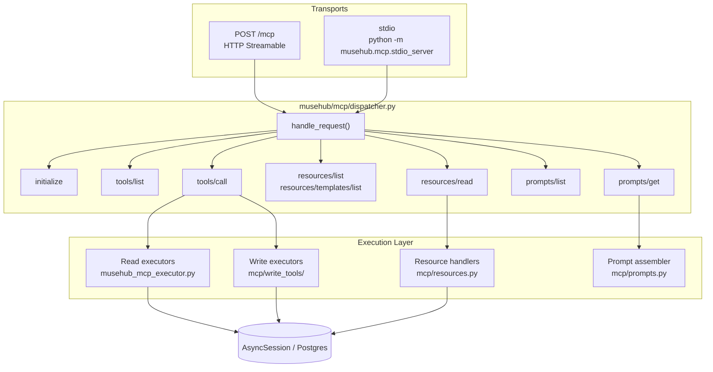
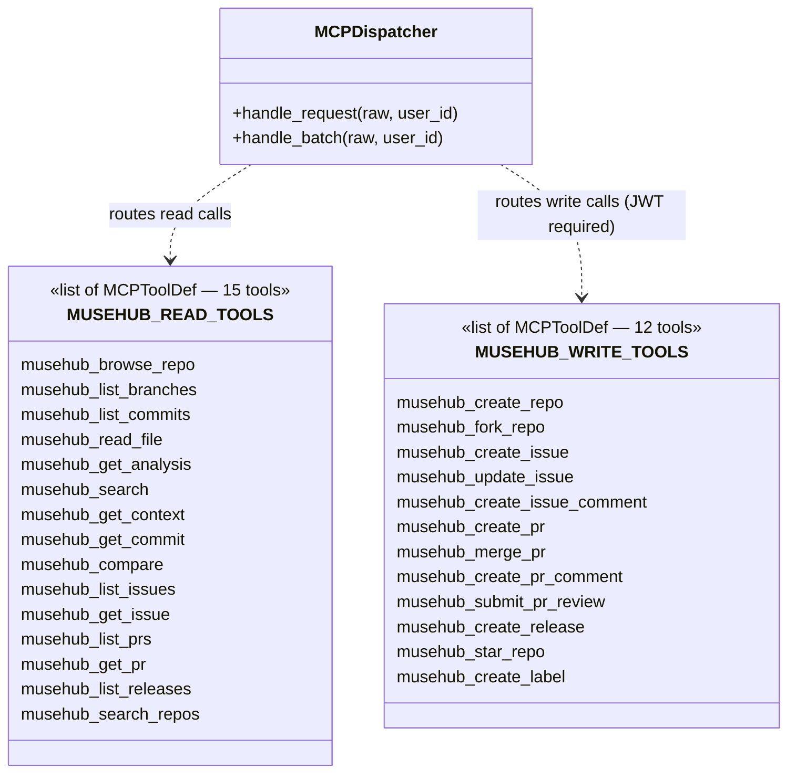
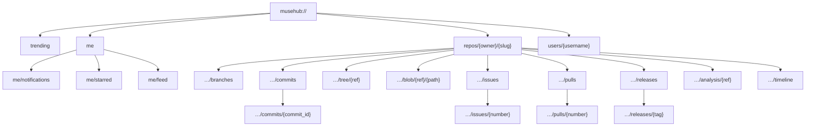

# MuseHub MCP Reference

> Protocol version: **2025-03-26** | Implementation: pure-Python async, no external MCP SDK

MuseHub treats AI agents as first-class citizens. The MCP integration gives agents complete capability parity with the web UI: they can browse, search, compose, review, and publish — over a standard protocol that every major agent runtime supports.

---

## Table of Contents

1. [Architecture](#architecture)
2. [Transports](#transports)
3. [Authentication](#authentication)
4. [Tools — 27 total](#tools)
   - [Read Tools (15)](#read-tools-15)
   - [Write Tools (12)](#write-tools-12)
5. [Resources — 20 total](#resources)
   - [Static Resources (5)](#static-resources-5)
   - [Templated Resources (15)](#templated-resources-15)
6. [Prompts — 6 total](#prompts)
7. [Error Handling](#error-handling)
8. [Usage Patterns](#usage-patterns)
9. [Architecture Diagrams](#architecture-diagrams)

---

## Architecture

```
MCP Client (Cursor, Claude Desktop, any SDK)
        │
        ├─ HTTP  POST /mcp        (production)
        └─ stdio python -m musehub.mcp.stdio_server  (local dev)
                │
        musehub/mcp/dispatcher.py   ← async JSON-RPC 2.0 engine
                │
        ┌───────┼───────────────┐
        │       │               │
   tools/call  resources/read  prompts/get
        │       │               │
   Read executors   Resource handlers   Prompt assembler
   (musehub_mcp_executor.py)  (resources.py)  (prompts.py)
   Write executors
   (mcp/write_tools/)
        │
   AsyncSession → Postgres
```

The dispatcher speaks JSON-RPC 2.0 directly. The HTTP envelope is always `200 OK` — tool errors are signalled via `isError: true` on the content block, not via HTTP status codes. Notifications (no `id` field) return `202 Accepted` with an empty body.

---

## Transports

### HTTP Streamable — `POST /mcp`

The production transport. Accepts `application/json`.

```http
POST /mcp HTTP/1.1
Content-Type: application/json
Authorization: Bearer <jwt>

{"jsonrpc":"2.0","id":1,"method":"tools/list"}
```

**Batch requests** — send a JSON array; responses are returned as an array in the same order (notifications are filtered out):

```http
POST /mcp
[
  {"jsonrpc":"2.0","id":1,"method":"tools/list"},
  {"jsonrpc":"2.0","id":2,"method":"resources/list"}
]
```

**Notifications** (no `id`) return `202 Accepted` with an empty body.

### stdio — `python -m musehub.mcp.stdio_server`

The local dev and Cursor IDE transport. Reads newline-delimited JSON from `stdin`, writes JSON-RPC responses to `stdout`, logs to `stderr`.

**Cursor IDE integration** — create or update `.cursor/mcp.json` in your workspace:

```json
{
  "mcpServers": {
    "musehub": {
      "command": "python",
      "args": ["-m", "musehub.mcp.stdio_server"],
      "cwd": "/path/to/musehub"
    }
  }
}
```

The stdio server runs without auth (trusted local process). Write tools are available unconditionally.

---

## Authentication

| Context | How |
|---------|-----|
| HTTP transport — read tools + public resources | No auth required |
| HTTP transport — write tools | `Authorization: Bearer <jwt>` |
| HTTP transport — private repo resources | `Authorization: Bearer <jwt>` |
| stdio transport | No auth (trusted process) |

The JWT is the same token issued by the MuseHub auth endpoints (`POST /api/v1/auth/token`). The `sub` claim is used as the acting `user_id` for all write operations.

Attempting a write tool without a valid token returns a JSON-RPC error (`code: -32001`, `message: "Authentication required for write tools"`).

---

## Tools

All 27 tools use `server_side: true`. The JSON-RPC envelope is always a success response — errors are represented inside the content block via `isError: true`.

### Calling a tool

```json
{
  "jsonrpc": "2.0",
  "id": 1,
  "method": "tools/call",
  "params": {
    "name": "musehub_browse_repo",
    "arguments": { "repo_id": "abc123" }
  }
}
```

Response:

```json
{
  "jsonrpc": "2.0",
  "id": 1,
  "result": {
    "content": [{ "type": "text", "text": "{\"name\":\"my-song\", ...}" }],
    "isError": false
  }
}
```

---

### Read Tools (15)

#### `musehub_browse_repo`

Orientation snapshot for a repo: metadata, default branch, recent commits, top-level file list.

| Parameter | Type | Required | Description |
|-----------|------|----------|-------------|
| `repo_id` | string | yes | Repository UUID |

---

#### `musehub_list_branches`

All branches with their head commit IDs and timestamps.

| Parameter | Type | Required | Description |
|-----------|------|----------|-------------|
| `repo_id` | string | yes | Repository UUID |

---

#### `musehub_list_commits`

Paginated commit history, newest first.

| Parameter | Type | Required | Description |
|-----------|------|----------|-------------|
| `repo_id` | string | yes | Repository UUID |
| `branch` | string | no | Branch name filter |
| `limit` | integer | no | Max commits (default 20) |

---

#### `musehub_read_file`

Metadata for a single artifact (MIDI, MP3, WebP, etc.) at a given commit.

| Parameter | Type | Required | Description |
|-----------|------|----------|-------------|
| `repo_id` | string | yes | Repository UUID |
| `path` | string | yes | File path within the repo |
| `commit_id` | string | no | Commit SHA (defaults to HEAD) |

---

#### `musehub_get_analysis`

13-dimension musical analysis for a repo at a given ref.

| Parameter | Type | Required | Description |
|-----------|------|----------|-------------|
| `repo_id` | string | yes | Repository UUID |
| `ref` | string | no | Branch, tag, or commit SHA |
| `mode` | string | no | `"overview"` (default), `"commits"`, or `"objects"` |

---

#### `musehub_search`

Keyword/path search over commits and file paths within a repo.

| Parameter | Type | Required | Description |
|-----------|------|----------|-------------|
| `repo_id` | string | yes | Repository UUID |
| `query` | string | yes | Search terms |

---

#### `musehub_get_context`

Full AI context document for a repo — combines metadata, analysis, recent activity, and usage hints into a single structured payload.

| Parameter | Type | Required | Description |
|-----------|------|----------|-------------|
| `repo_id` | string | yes | Repository UUID |

---

#### `musehub_get_commit`

Single commit detail with the full snapshot manifest (all file paths and content hashes at that point in history).

| Parameter | Type | Required | Description |
|-----------|------|----------|-------------|
| `repo_id` | string | yes | Repository UUID |
| `commit_id` | string | yes | Commit SHA |

---

#### `musehub_compare`

Musical diff between two refs — returns per-dimension change scores (harmony, rhythm, groove, key, tempo) and a list of changed file paths.

| Parameter | Type | Required | Description |
|-----------|------|----------|-------------|
| `repo_id` | string | yes | Repository UUID |
| `base_ref` | string | yes | Base branch, tag, or commit SHA |
| `head_ref` | string | yes | Head branch, tag, or commit SHA |

---

#### `musehub_list_issues`

Issues with optional state, label, and assignee filters.

| Parameter | Type | Required | Description |
|-----------|------|----------|-------------|
| `repo_id` | string | yes | Repository UUID |
| `state` | string | no | `"open"` (default) or `"closed"` |
| `label` | string | no | Label name filter |
| `assignee` | string | no | Assignee username filter |

---

#### `musehub_get_issue`

Single issue with its full comment thread.

| Parameter | Type | Required | Description |
|-----------|------|----------|-------------|
| `repo_id` | string | yes | Repository UUID |
| `issue_number` | integer | yes | Issue number |

---

#### `musehub_list_prs`

Pull requests with optional state and base branch filters.

| Parameter | Type | Required | Description |
|-----------|------|----------|-------------|
| `repo_id` | string | yes | Repository UUID |
| `state` | string | no | `"open"` (default), `"closed"`, or `"merged"` |
| `base` | string | no | Target branch filter |

---

#### `musehub_get_pr`

Single PR with all inline comments and reviews.

| Parameter | Type | Required | Description |
|-----------|------|----------|-------------|
| `repo_id` | string | yes | Repository UUID |
| `pr_number` | integer | yes | Pull request number |

---

#### `musehub_list_releases`

All releases for a repo with asset counts and timestamps.

| Parameter | Type | Required | Description |
|-----------|------|----------|-------------|
| `repo_id` | string | yes | Repository UUID |

---

#### `musehub_search_repos`

Discover public repos by text query or musical attributes.

| Parameter | Type | Required | Description |
|-----------|------|----------|-------------|
| `query` | string | no | Text search query |
| `key` | string | no | Musical key filter (e.g. `"C major"`) |
| `tempo_min` | integer | no | Minimum BPM |
| `tempo_max` | integer | no | Maximum BPM |
| `tags` | array of strings | no | Tag filters |
| `limit` | integer | no | Max results (default 20) |

---

### Write Tools (12)

> All write tools require `Authorization: Bearer <jwt>` on the HTTP transport.

#### `musehub_create_repo`

Create a new repository.

| Parameter | Type | Required | Description |
|-----------|------|----------|-------------|
| `name` | string | yes | Repository name |
| `owner` | string | yes | Owner username |
| `owner_user_id` | string | yes | Owner user UUID |
| `description` | string | no | Short description |
| `visibility` | string | no | `"public"` (default) or `"private"` |
| `tags` | array of strings | no | Initial tags |
| `key_signature` | string | no | Musical key (e.g. `"G major"`) |
| `tempo_bpm` | integer | no | Tempo in BPM |
| `initialize` | boolean | no | Create initial commit (default `true`) |

---

#### `musehub_fork_repo`

Fork an existing repository into the authenticated user's account.

| Parameter | Type | Required | Description |
|-----------|------|----------|-------------|
| `repo_id` | string | yes | Source repository UUID |
| `new_owner` | string | yes | Fork owner username |
| `new_owner_user_id` | string | yes | Fork owner user UUID |

---

#### `musehub_create_issue`

Open a new issue.

| Parameter | Type | Required | Description |
|-----------|------|----------|-------------|
| `repo_id` | string | yes | Repository UUID |
| `title` | string | yes | Issue title |
| `body` | string | no | Issue description (Markdown) |
| `labels` | array of strings | no | Label names to apply |
| `assignee_id` | string | no | Assignee user UUID |

---

#### `musehub_update_issue`

Update issue state or metadata.

| Parameter | Type | Required | Description |
|-----------|------|----------|-------------|
| `repo_id` | string | yes | Repository UUID |
| `issue_number` | integer | yes | Issue number |
| `state` | string | no | `"open"` or `"closed"` |
| `title` | string | no | New title |
| `body` | string | no | New body |
| `assignee_id` | string | no | New assignee UUID |
| `labels` | array of strings | no | Replace label set |

---

#### `musehub_create_issue_comment`

Post a comment on an issue.

| Parameter | Type | Required | Description |
|-----------|------|----------|-------------|
| `repo_id` | string | yes | Repository UUID |
| `issue_number` | integer | yes | Issue number |
| `body` | string | yes | Comment body (Markdown) |

---

#### `musehub_create_pr`

Open a pull request.

| Parameter | Type | Required | Description |
|-----------|------|----------|-------------|
| `repo_id` | string | yes | Repository UUID |
| `title` | string | yes | PR title |
| `from_branch` | string | yes | Source branch |
| `to_branch` | string | yes | Target branch |
| `body` | string | no | PR description (Markdown) |

---

#### `musehub_merge_pr`

Merge an open pull request.

| Parameter | Type | Required | Description |
|-----------|------|----------|-------------|
| `repo_id` | string | yes | Repository UUID |
| `pr_number` | integer | yes | Pull request number |
| `merge_message` | string | no | Custom merge commit message |

---

#### `musehub_create_pr_comment`

Post an inline comment on a PR. Supports general, track-level, and beat-range comments — mirroring the musical diff view in the web UI.

| Parameter | Type | Required | Description |
|-----------|------|----------|-------------|
| `repo_id` | string | yes | Repository UUID |
| `pr_number` | integer | yes | Pull request number |
| `body` | string | yes | Comment body (Markdown) |
| `target_type` | string | no | `"general"` (default), `"track"`, `"region"`, or `"note"` |
| `target_track` | string | no | Track name (when `target_type` is `"track"` or finer) |
| `target_beat_start` | number | no | Start beat position |
| `target_beat_end` | number | no | End beat position |

---

#### `musehub_submit_pr_review`

Submit a formal review on a PR.

| Parameter | Type | Required | Description |
|-----------|------|----------|-------------|
| `repo_id` | string | yes | Repository UUID |
| `pr_number` | integer | yes | Pull request number |
| `state` | string | yes | `"approved"`, `"changes_requested"`, or `"commented"` |
| `body` | string | no | Review summary |

---

#### `musehub_create_release`

Publish a release.

| Parameter | Type | Required | Description |
|-----------|------|----------|-------------|
| `repo_id` | string | yes | Repository UUID |
| `tag` | string | yes | Tag name (e.g. `"v1.0.0"`) |
| `title` | string | yes | Release title |
| `body` | string | no | Release notes (Markdown) |
| `commit_id` | string | no | Target commit SHA (defaults to HEAD) |
| `is_prerelease` | boolean | no | Mark as pre-release (default `false`) |

---

#### `musehub_star_repo`

Star a repository.

| Parameter | Type | Required | Description |
|-----------|------|----------|-------------|
| `repo_id` | string | yes | Repository UUID |

---

#### `musehub_create_label`

Create a label scoped to a repository.

| Parameter | Type | Required | Description |
|-----------|------|----------|-------------|
| `repo_id` | string | yes | Repository UUID |
| `name` | string | yes | Label name |
| `color` | string | yes | Hex color (e.g. `"#0075ca"`) |
| `description` | string | no | Label description |

---

## Resources

Resources are side-effect-free, cacheable, URI-addressable reads. All resources return `application/json`. They are read via the `resources/read` method.

### Listing resources

```json
{"jsonrpc":"2.0","id":1,"method":"resources/list"}
{"jsonrpc":"2.0","id":2,"method":"resources/templates/list"}
```

### Reading a resource

```json
{
  "jsonrpc": "2.0",
  "id": 1,
  "method": "resources/read",
  "params": { "uri": "musehub://trending" }
}
```

Response:

```json
{
  "jsonrpc": "2.0",
  "id": 1,
  "result": {
    "contents": [{
      "uri": "musehub://trending",
      "mimeType": "application/json",
      "text": "[{\"repo_id\":\"...\",\"name\":\"my-song\",...}]"
    }]
  }
}
```

---

### Static Resources (5)

#### `musehub://trending`

Top 20 public repos ordered by star count. Anonymous-accessible.

**Returns:** array of repo summaries with `repo_id`, `name`, `owner`, `slug`, `description`, `visibility`, `clone_url`, `created_at`.

---

#### `musehub://me`

Authenticated user's profile and their most recent 20 repos. Requires JWT.

**Returns:** `{ "user_id", "username", "repos": [...] }`

---

#### `musehub://me/notifications`

Unread notifications for the authenticated user. Requires JWT.

**Returns:** `{ "notifications": [{ "id", "event_type", "read", "created_at" }] }`

---

#### `musehub://me/starred`

Repos the authenticated user has starred. Requires JWT.

**Returns:** `{ "starred": [{ "repo_id", "name", "owner", "slug", "starred_at" }] }`

---

#### `musehub://me/feed`

Activity feed for repos the authenticated user watches. Requires JWT.

**Returns:** `{ "feed": [...] }`

---

### Templated Resources (15)

All templated resources follow RFC 6570 Level 1. `{owner}` and `{slug}` are resolved to a `repo_id` by the dispatcher — agents use human-readable names, not UUIDs.

#### `musehub://repos/{owner}/{slug}`

Repo overview: metadata, visibility, default branch, tag list, description.

---

#### `musehub://repos/{owner}/{slug}/branches`

All branches with their name, head commit ID, and last-updated timestamp.

---

#### `musehub://repos/{owner}/{slug}/commits`

20 most recent commits on the default branch. Includes commit message, author, timestamp.

---

#### `musehub://repos/{owner}/{slug}/commits/{commit_id}`

Single commit with its full snapshot manifest (all file paths and content hashes at that point).

---

#### `musehub://repos/{owner}/{slug}/tree/{ref}`

File tree at a given ref. Returns all object paths and guessed MIME types.

---

#### `musehub://repos/{owner}/{slug}/blob/{ref}/{path}`

Metadata for a single file at a given ref: path, content hash, MIME type, size.

---

#### `musehub://repos/{owner}/{slug}/issues`

Open issues list with labels, assignees, and comment counts.

---

#### `musehub://repos/{owner}/{slug}/issues/{number}`

Single issue with its full comment thread.

---

#### `musehub://repos/{owner}/{slug}/pulls`

Open PRs with source/target branches and review counts.

---

#### `musehub://repos/{owner}/{slug}/pulls/{number}`

Single PR with all inline comments and reviews (reviewer, state, body).

---

#### `musehub://repos/{owner}/{slug}/releases`

All releases ordered newest first: tag, title, body, asset count, timestamp.

---

#### `musehub://repos/{owner}/{slug}/releases/{tag}`

Single release matching a tag name, including the full release notes body.

---

#### `musehub://repos/{owner}/{slug}/analysis/{ref}`

Musical analysis at a given ref: key, tempo, time signature, per-dimension scores (harmony, rhythm, groove, dynamics, orchestration, …).

---

#### `musehub://repos/{owner}/{slug}/timeline`

Musical evolution timeline: commits, section events, and track events in chronological order.

---

#### `musehub://users/{username}`

User profile and their 20 most recent public repos.

---

## Prompts

Prompts teach agents how to chain tools and resources to accomplish multi-step goals. They return a structured list of `role`/`content` messages that frame the task for the agent.

### Getting a prompt

```json
{
  "jsonrpc": "2.0",
  "id": 1,
  "method": "prompts/get",
  "params": {
    "name": "musehub/orientation"
  }
}
```

With arguments:

```json
{
  "jsonrpc": "2.0",
  "id": 1,
  "method": "prompts/get",
  "params": {
    "name": "musehub/contribute",
    "arguments": {
      "repo_id": "abc123",
      "owner": "alice",
      "slug": "my-song"
    }
  }
}
```

---

### `musehub/orientation`

**Arguments:** none

The essential first read for any new agent. Explains MuseHub's model (repos, commits, branches, musical analysis), the `musehub://` URI scheme, which tools to use for reads vs. writes, and how to authenticate.

---

### `musehub/contribute`

**Arguments:** `repo_id`, `owner`, `slug`

End-to-end contribution workflow:

1. `musehub_get_context` — understand the repo
2. `musehub://repos/{owner}/{slug}/issues` — find open issues
3. `musehub_create_issue` — or create a new one
4. Make changes, push a commit
5. `musehub_create_pr` — open a PR
6. `musehub_submit_pr_review` — request review
7. `musehub_merge_pr` — merge when approved

---

### `musehub/compose`

**Arguments:** `repo_id`

Musical composition workflow:

1. `musehub_get_context` — understand existing tracks and structure
2. `musehub://repos/{owner}/{slug}/analysis/{ref}` — study the musical analysis
3. Compose new MIDI matching key/tempo/style
4. Push the commit
5. Verify the new analysis with `musehub_get_analysis`

---

### `musehub/review_pr`

**Arguments:** `repo_id`, `pr_id`

Musical PR review:

1. `musehub_get_pr` — read the PR metadata
2. `musehub_compare` — get per-dimension diff scores
3. `musehub://repos/{owner}/{slug}/analysis/{ref}` — compare analyses for base and head
4. `musehub_create_pr_comment` — post track/region-level comments
5. `musehub_submit_pr_review` — approve or request changes

---

### `musehub/issue_triage`

**Arguments:** `repo_id`

Triage open issues:

1. `musehub_list_issues` — list open issues
2. Categorise by type (bug, feature, discussion)
3. `musehub_create_label` — create missing labels
4. `musehub_update_issue` — apply labels, assign, close duplicates

---

### `musehub/release_prep`

**Arguments:** `repo_id`

Prepare a release:

1. `musehub_list_prs` — find merged PRs since the last release
2. `musehub_list_releases` — check the latest release tag
3. `musehub_get_analysis` — summarise musical changes
4. Draft release notes (Markdown)
5. `musehub_create_release` — publish

---

## Error Handling

### JSON-RPC error codes

| Code | Meaning |
|------|---------|
| `-32700` | Parse error — request body is not valid JSON |
| `-32600` | Invalid request — not an object or array |
| `-32601` | Method not found |
| `-32602` | Invalid params — required argument missing or wrong type |
| `-32603` | Internal error — unexpected server exception |
| `-32001` | Authentication required — write tool called without valid JWT |

### Tool errors

Tool execution errors are not JSON-RPC errors. The envelope is always a success response; the error is signalled inside the result:

```json
{
  "result": {
    "content": [{ "type": "text", "text": "repo not found: abc123" }],
    "isError": true
  }
}
```

---

## Usage Patterns

### Pattern 1: Discover and explore

```
1. resources/read  musehub://trending             → pick a repo
2. resources/read  musehub://repos/{owner}/{slug}  → orientation
3. tools/call      musehub_get_context             → full AI context
4. resources/read  musehub://repos/{owner}/{slug}/analysis/{ref}  → musical detail
```

### Pattern 2: Fix a bug, open a PR

```
1. tools/call   musehub_list_issues { repo_id, state: "open" }
2. tools/call   musehub_get_issue { repo_id, issue_number }
3. tools/call   musehub_browse_repo { repo_id }
4. tools/call   musehub_read_file { repo_id, path }
5. -- compose fix, push commit --
6. tools/call   musehub_create_pr { repo_id, title, from_branch, to_branch }
```

### Pattern 3: Full musical PR review

```
1. tools/call   musehub_get_pr { repo_id, pr_number }
2. tools/call   musehub_compare { repo_id, base_ref, head_ref }
3. resources/read  musehub://repos/{owner}/{slug}/analysis/{base_ref}
4. resources/read  musehub://repos/{owner}/{slug}/analysis/{head_ref}
5. tools/call   musehub_create_pr_comment {
     repo_id, pr_number, body: "...",
     target_type: "track", target_track: "Bass",
     target_beat_start: 0, target_beat_end: 32
   }
6. tools/call   musehub_submit_pr_review { repo_id, pr_number, state: "approved" }
```

### Pattern 4: Publish a release

```
1. tools/call   musehub_list_releases { repo_id }
2. tools/call   musehub_list_prs { repo_id, state: "closed" }
3. tools/call   musehub_get_analysis { repo_id, ref: "main" }
4. tools/call   musehub_create_release {
     repo_id, tag: "v1.2.0", title: "Spring Drop",
     body: "## What changed\n..."
   }
```

---

## Architecture Diagrams

### Request flow



### Tool catalogue structure



### Resource URI hierarchy


