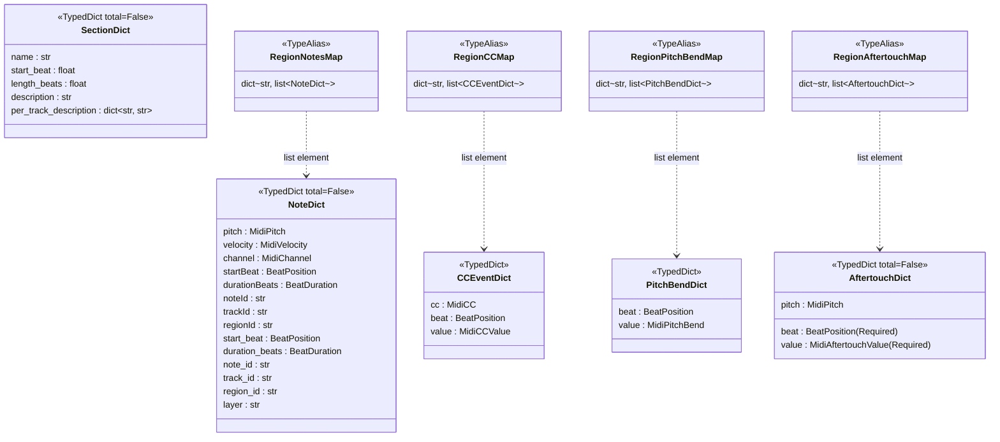
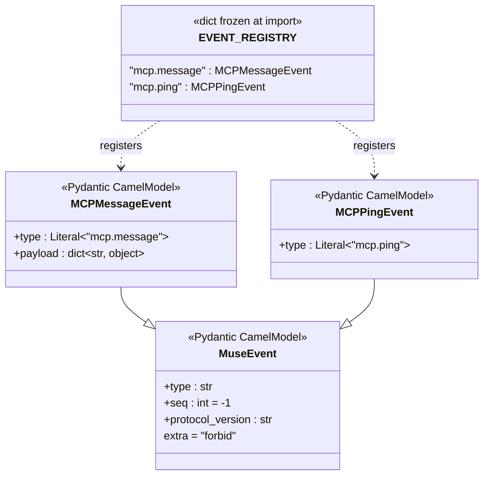
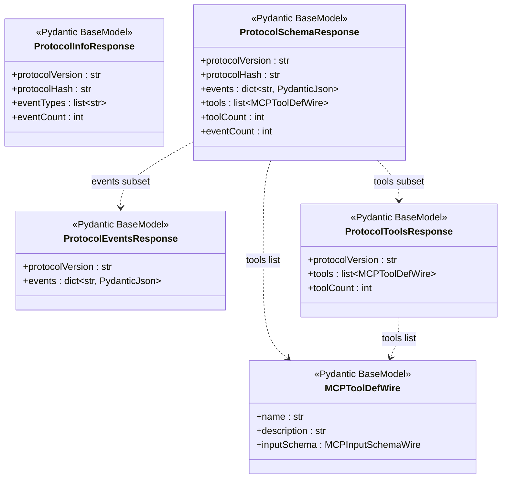
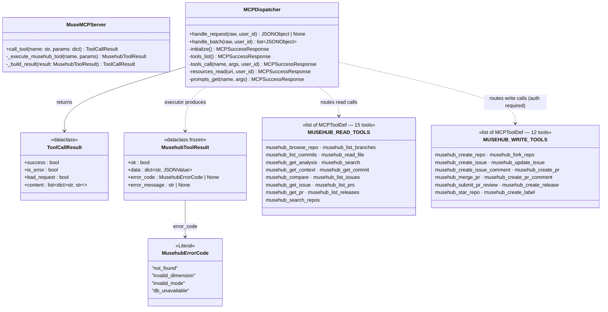
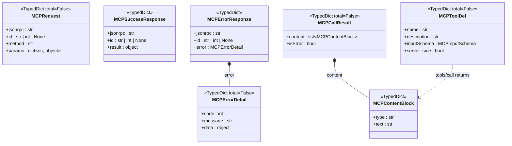
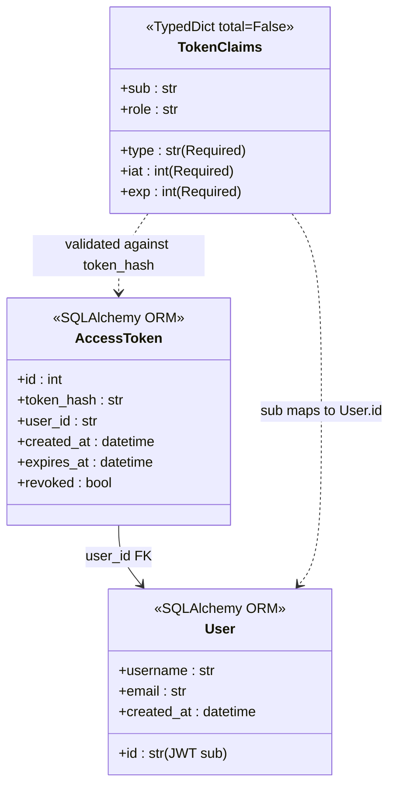
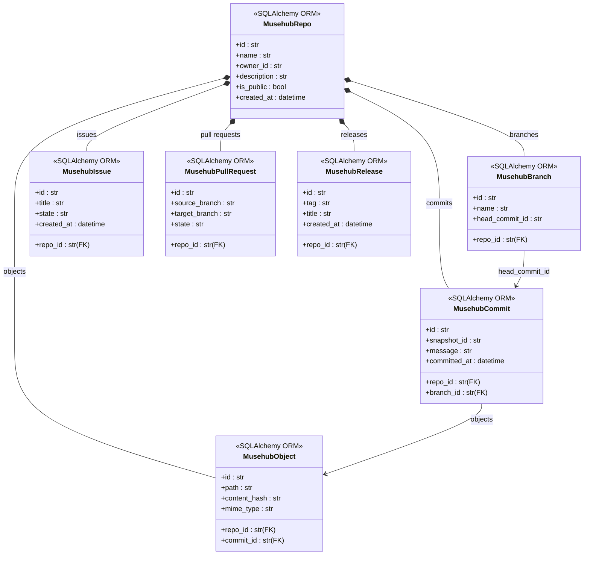
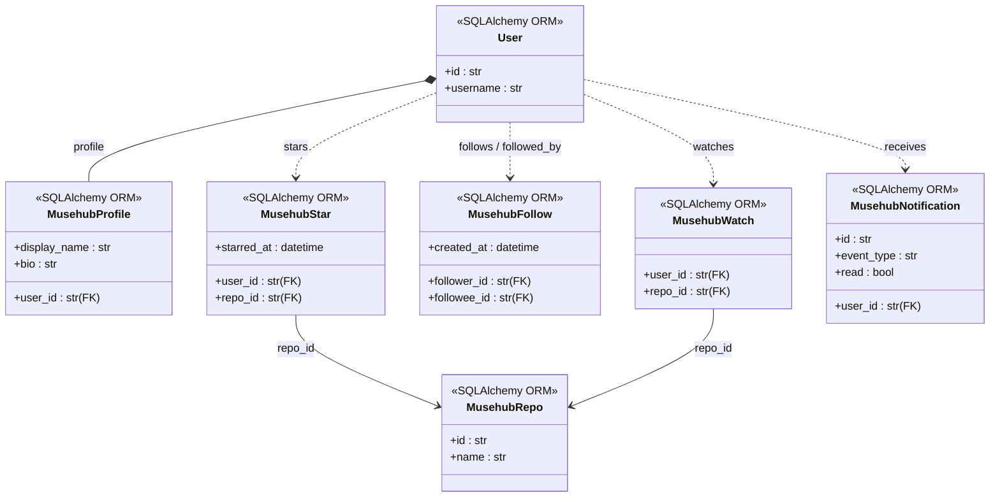
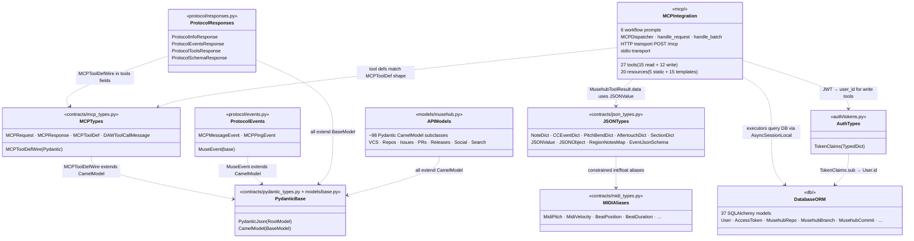

# MuseHub — Type Contracts Reference

> Updated: 2026-03-17 | MCP Protocol: **2025-11-25** | Covers every named entity in the MuseHub surface:
> MIDI type aliases, JSON wire types, MCP protocol types (including Elicitation, Session, and SSE),
> Pydantic API models, auth tokens, SSE event hierarchy, SQLAlchemy ORM models, and the full
> MCP integration layer (Streamable HTTP transport, session management, dispatcher, resources,
> prompts, read tools, write tools, elicitation-powered tools).
> `Any` and bare `list` / `dict` (without type arguments) do not appear in any
> production file. Every type boundary is named. The mypy strict ratchet
> enforces zero violations on every CI run across 111 source files.

---

## Table of Contents

1. [Design Philosophy](#design-philosophy)
2. [MIDI Type Aliases (`contracts/midi_types.py`)](#midi-type-aliases)
3. [JSON Type Aliases (`contracts/json_types.py`)](#json-type-aliases)
4. [JSON Wire TypedDicts (`contracts/json_types.py`)](#json-wire-typeddicts)
5. [MCP Protocol Types (`contracts/mcp_types.py`)](#mcp-protocol-types)
6. [MCP Integration Layer (`mcp/`)](#mcp-integration-layer)
7. [Pydantic Base Types (`contracts/pydantic_types.py`, `models/base.py`)](#pydantic-base-types)
8. [Auth Types (`auth/tokens.py`)](#auth-types)
9. [Protocol Events (`protocol/events.py`)](#protocol-events)
10. [Protocol HTTP Responses (`protocol/responses.py`)](#protocol-http-responses)
11. [API Models (`models/musehub.py`)](#api-models)
12. [Database ORM Models (`db/`)](#database-orm-models)
13. [Entity Hierarchy](#entity-hierarchy)
14. [Entity Graphs (Mermaid)](#entity-graphs-mermaid)

---

## Design Philosophy

Every entity in this codebase follows five rules:

1. **No `Any`. No bare `object`. Ever.** Both collapse type safety for downstream
   callers. Every boundary is typed with a concrete named entity — `TypedDict`,
   `dataclass`, Pydantic model, or a specific union. The CI mypy strict ratchet
   enforces zero violations.

2. **No covariance in collection aliases.** `dict[str, str]` and `list[str]`
   are used directly. If a return mixes value types, a `TypedDict` names that
   shape instead of a `dict[str, str | int]`.

3. **Boundaries own coercion.** When external data arrives (JSON over HTTP,
   bytes from the database, MIDI off the wire), the boundary module coerces to
   the canonical internal type. Downstream code always sees clean types.

4. **Wire-format TypedDicts for JSON serialisation, Pydantic models for HTTP.**
   `TokenClaims`, `NoteDict`, `MCPRequest` etc. are JSON-serialisable and
   used at IO boundaries. Pydantic `CamelModel` subclasses are used for all
   FastAPI route return types and request bodies.

5. **No `# type: ignore`. Fix the underlying error instead.** The one designated
   exception is the `json_list()` coercion boundary — a single
   `type: ignore[arg-type]` inside the implementation body of that helper.

### Banned → Use instead

| Banned | Use instead |
|--------|-------------|
| `Any` | `TypedDict`, `dataclass`, specific union |
| `object` | The actual type or a constrained union |
| `list` (bare) | `list[X]` with concrete element type |
| `dict` (bare) | `dict[K, V]` with concrete key/value types |
| `dict[str, X]` with known keys | `TypedDict` — name the keys |
| `Optional[X]` | `X \| None` |
| Legacy `List`, `Dict`, `Set`, `Tuple` | Lowercase builtins |
| `Union[A, B]` | `A \| B` |
| `Type[X]` | `type[X]` |
| `cast(T, x)` | Fix the callee to return `T` |
| `# type: ignore` | Fix the underlying type error |

---

## MIDI Type Aliases

**Path:** `musehub/contracts/midi_types.py`

Constrained `int` and `float` aliases via `Annotated[int, Field(...)]`.
Every MIDI boundary uses these instead of bare `int` so that range constraints
are part of the type signature and enforced by Pydantic at validation time.

| Alias | Base | Constraint | Description |
|-------|------|------------|-------------|
| `MidiPitch` | `int` | 0–127 | MIDI note number (C-1=0, Middle C=60, G9=127) |
| `MidiVelocity` | `int` | 0–127 | Note velocity; 0=note-off, 1–127=audible |
| `MidiChannel` | `int` | 0–15 | Zero-indexed MIDI channel; drums=9 |
| `MidiCC` | `int` | 0–127 | MIDI Control Change controller number |
| `MidiCCValue` | `int` | 0–127 | MIDI Control Change value |
| `MidiAftertouchValue` | `int` | 0–127 | Channel or poly aftertouch pressure |
| `MidiGMProgram` | `int` | 0–127 | General MIDI program / patch number (0-indexed) |
| `MidiPitchBend` | `int` | −8192–8191 | 14-bit signed pitch bend; 0=centre |
| `MidiBPM` | `int` | 20–300 | Tempo in beats per minute (always integer) |
| `BeatPosition` | `float` | ≥ 0.0 | Absolute beat position; fractional allowed |
| `BeatDuration` | `float` | > 0.0 | Duration in beats; must be strictly positive |
| `ArrangementBeat` | `int` | ≥ 0 | Bar-aligned beat offset for section-level timing |
| `ArrangementDuration` | `int` | ≥ 1 | Section duration in beats (bars × numerator) |
| `Bars` | `int` | ≥ 1 | Bar count; always a positive integer |

---

## JSON Type Aliases

**Path:** `musehub/contracts/json_types.py`

Type aliases for recursive and domain-specific JSON shapes.

| Alias | Definition | Description |
|-------|-----------|-------------|
| `JSONScalar` | `str \| int \| float \| bool \| None` | A JSON leaf value with no recursive structure |
| `JSONValue` | `str \| int \| float \| bool \| None \| list["JSONValue"] \| dict[str, "JSONValue"]` | Recursive JSON value — use sparingly, never in Pydantic models |
| `JSONObject` | `dict[str, JSONValue]` | A JSON object with an unknown key set |
| `InternalNoteDict` | `NoteDict` | Alias for `NoteDict` on the snake_case storage path |
| `RegionNotesMap` | `dict[str, list[NoteDict]]` | Maps `region_id` → ordered list of MIDI notes |
| `RegionCCMap` | `dict[str, list[CCEventDict]]` | Maps `region_id` → ordered list of MIDI CC events |
| `RegionPitchBendMap` | `dict[str, list[PitchBendDict]]` | Maps `region_id` → ordered list of MIDI pitch bend events |
| `RegionAftertouchMap` | `dict[str, list[AftertouchDict]]` | Maps `region_id` → ordered list of MIDI aftertouch events |
| `EventJsonSchema` | `dict[str, JSONValue]` | JSON Schema dict for a single event type, as produced by `model_json_schema()` |
| `EventSchemaMap` | `dict[str, EventJsonSchema]` | Maps `event_type` → its JSON Schema; returned by `/protocol/events.json` |

---

## JSON Wire TypedDicts

**Path:** `musehub/contracts/json_types.py`

These are the MIDI note and event shapes exchanged across service boundaries.
All use `total=False` where the producer may omit fields, and `Required[T]`
to mark fields that must always be present.

### `NoteDict`

`TypedDict (total=False)` — A single MIDI note. Accepts both camelCase (wire
format) and snake_case (internal storage) to avoid a transform boundary.

| Field | Type | Description |
|-------|------|-------------|
| `pitch` | `MidiPitch` | MIDI pitch number |
| `velocity` | `MidiVelocity` | Note velocity |
| `channel` | `MidiChannel` | MIDI channel |
| `startBeat` | `BeatPosition` | Onset beat (camelCase wire) |
| `durationBeats` | `BeatDuration` | Duration in beats (camelCase wire) |
| `noteId` | `str` | Note UUID (camelCase wire) |
| `trackId` | `str` | Parent track UUID (camelCase wire) |
| `regionId` | `str` | Parent region UUID (camelCase wire) |
| `start_beat` | `BeatPosition` | Onset beat (snake_case storage) |
| `duration_beats` | `BeatDuration` | Duration in beats (snake_case storage) |
| `note_id` | `str` | Note UUID (snake_case storage) |
| `track_id` | `str` | Parent track UUID (snake_case storage) |
| `region_id` | `str` | Parent region UUID (snake_case storage) |
| `layer` | `str` | Optional layer grouping (e.g. `"melody"`) |

### `CCEventDict`

`TypedDict` — A single MIDI Control Change event.

| Field | Type |
|-------|------|
| `cc` | `MidiCC` |
| `beat` | `BeatPosition` |
| `value` | `MidiCCValue` |

### `PitchBendDict`

`TypedDict` — A single MIDI pitch bend event.

| Field | Type |
|-------|------|
| `beat` | `BeatPosition` |
| `value` | `MidiPitchBend` |

### `AftertouchDict`

`TypedDict (total=False)` — MIDI aftertouch (channel or poly).

| Field | Type | Required |
|-------|------|----------|
| `beat` | `BeatPosition` | Yes |
| `value` | `MidiAftertouchValue` | Yes |
| `pitch` | `MidiPitch` | No (poly only) |

### `SectionDict`

`TypedDict (total=False)` — A composition section (verse, chorus, bridge, etc.).
Used by the analysis service to describe structural section metadata.

| Field | Type |
|-------|------|
| `name` | `str` |
| `start_beat` | `float` |
| `length_beats` | `float` |
| `description` | `str` |
| `per_track_description` | `dict[str, str]` |

### Conversion helpers

| Function | Signature | Description |
|----------|-----------|-------------|
| `is_note_dict(v)` | `(JSONValue) -> TypeGuard[NoteDict]` | Narrows `JSONValue` to `NoteDict` in list comprehensions |
| `jfloat(v, default)` | `(JSONValue, float) -> float` | Safe float extraction from `JSONValue` |
| `jint(v, default)` | `(JSONValue, int) -> int` | Safe int extraction from `JSONValue` |
| `json_list(items)` | overloaded | Coerces a `list[TypedDict]` to `list[JSONValue]` at insertion boundaries |

---

## MCP Protocol Types

**Path:** `musehub/contracts/mcp_types.py`

Typed shapes for the Model Context Protocol 2025-11-25 JSON-RPC 2.0 interface.
TypedDicts cover the wire format; Pydantic models (`MCPToolDefWire` etc.) are
used for FastAPI response serialisation.

### Type Aliases

| Alias | Definition |
|-------|-----------|
| `MCPResponse` | `MCPSuccessResponse \| MCPErrorResponse` |
| `MCPMethodResponse` | `MCPInitializeResponse \| MCPToolsListResponse \| MCPCallResponse \| MCPSuccessResponse \| MCPErrorResponse` |

### Request / Response TypedDicts

| Name | Kind | Description |
|------|------|-------------|
| `MCPRequest` | `total=False` | Incoming JSON-RPC 2.0 message from an MCP client |
| `MCPSuccessResponse` | required | JSON-RPC 2.0 success response |
| `MCPErrorDetail` | `total=False` | The `error` object inside a JSON-RPC error response |
| `MCPErrorResponse` | required | JSON-RPC 2.0 error response |
| `MCPInitializeParams` | `total=False` | Params for the `initialize` method |
| `MCPInitializeResult` | required | Result body for `initialize` |
| `MCPInitializeResponse` | required | Full response for `initialize` |
| `MCPToolsListResult` | required | Result body for `tools/list` |
| `MCPToolsListResponse` | required | Full response for `tools/list` |
| `MCPCallResult` | `total=False` | Result body for `tools/call` |
| `MCPCallResponse` | required | Full response for `tools/call` |

### Tool Definition TypedDicts

| Name | Kind | Description |
|------|------|-------------|
| `MCPPropertyDef` | `total=False` | JSON Schema definition for a single tool property |
| `MCPInputSchema` | `total=False` | JSON Schema for a tool's accepted arguments |
| `MCPToolDef` | `total=False` | Complete definition of an MCP tool |
| `MCPContentBlock` | required | Content block in a tool result (`type`, `text`) |

### Capability TypedDicts

| Name | Kind | Description |
|------|------|-------------|
| `MCPToolsCapability` | `total=False` | `tools` entry in `MCPCapabilities` |
| `MCPResourcesCapability` | `total=False` | `resources` entry in `MCPCapabilities` |
| `MCPCapabilities` | `total=False` | Server capabilities advertised during `initialize` |
| `MCPServerInfo` | required | Server info returned in `initialize` responses |
| `MCPCapabilitiesResult` | required | Capability block in `initialize` result |
| `MCPToolCallParams` | required | Params for `tools/call` |

### Elicitation TypedDicts (MCP 2025-11-25)

| Name | Kind | Description |
|------|------|-------------|
| `ElicitationAction` | `Literal` | `"accept"` \| `"decline"` \| `"cancel"` |
| `ElicitationRequest` | `total=False` | Server→client elicitation request: `mode` (`"form"` \| `"url"`), `schema` (form), `url` (URL), `message`, `request_id` |
| `ElicitationResponse` | required | Client→server elicitation response: `action` (`ElicitationAction`), `content` (form fields on accept) |
| `SessionInfo` | required | Active session summary: `session_id`, `user_id`, `created_at`, `last_active`, `pending_elicitations_count`, `sse_queue_count` |

### DAW ↔ MCP Bridge TypedDicts

| Name | Kind | Description |
|------|------|-------------|
| `DAWToolCallMessage` | required | Message sent from MCP server to a DAW client over WebSocket |
| `DAWToolResponse` | `total=False` | Response sent from the DAW back after tool execution |

### Pydantic Wire Models (FastAPI)

| Name | Description |
|------|-------------|
| `MCPPropertyDefWire` | Pydantic-safe JSON Schema property for FastAPI responses |
| `MCPInputSchemaWire` | Pydantic-safe tool input schema for FastAPI responses |
| `MCPToolDefWire` | Pydantic-safe tool definition for FastAPI route return types |

---

## MCP Integration Layer

**Paths:** `musehub/mcp/dispatcher.py`, `musehub/mcp/resources.py`,
`musehub/mcp/prompts.py`, `musehub/mcp/tools/`, `musehub/mcp/write_tools/`,
`musehub/mcp/session.py`, `musehub/mcp/sse.py`, `musehub/mcp/context.py`,
`musehub/mcp/elicitation.py`, `musehub/api/routes/mcp.py`, `musehub/mcp/stdio_server.py`

The MCP integration layer implements the full [MCP 2025-11-25 specification](https://modelcontextprotocol.io/specification/2025-11-25)
as a pure-Python async stack. No external MCP SDK dependency. Three HTTP endpoints
(`POST /mcp`, `GET /mcp`, `DELETE /mcp`) and stdio are supported.

### Session Layer (`mcp/session.py`)

Stateful connection management for the Streamable HTTP transport.

| Type / Export | Kind | Description |
|---------------|------|-------------|
| `MCPSession` | `@dataclass` | Active session: `session_id`, `user_id`, `client_capabilities`, `pending` (elicitation Futures), `sse_queues`, `event_buffer`, `created_at`, `last_active` |
| `create_session(user_id, client_capabilities)` | function | Mint a new session; registers background cleanup task |
| `get_session(session_id)` | function | Look up by ID; returns `None` if expired |
| `delete_session(session_id)` | function | Terminate session; drains SSE queues; cancels pending Futures |
| `push_to_session(session, event_text)` | function | Broadcast SSE event to all open GET /mcp consumers |
| `register_sse_queue(session, last_event_id)` | async generator | Yield SSE events; replay buffer; heartbeat-friendly |
| `create_pending_elicitation(session, request_id)` | function | Register a `Future` for an outbound `elicitation/create` |
| `resolve_elicitation(session, request_id, result)` | function | Set the Future result on client response |
| `cancel_elicitation(session, request_id)` | function | Cancel the Future on `notifications/cancelled` |

Session TTL: 1 hour of inactivity. Background cleanup runs every 5 minutes. SSE ring buffer holds 50 events for `Last-Event-ID` replay.

### SSE Utilities (`mcp/sse.py`)

| Export | Signature | Description |
|--------|-----------|-------------|
| `sse_event(data, *, event_id, event_type, retry_ms)` | `(JSONObject, ...) → str` | Format a JSON object as an SSE event string ending with `\n\n` |
| `sse_notification(method, params, *, event_id)` | `(str, ...) → str` | Format a JSON-RPC 2.0 notification as SSE |
| `sse_request(req_id, method, params, *, event_id)` | `(str\|int, str, ...) → str` | Format a JSON-RPC 2.0 request (server-initiated) as SSE |
| `sse_response(req_id, result, *, event_id)` | `(str\|int\|None, JSONObject, ...) → str` | Format a JSON-RPC 2.0 success response as SSE |
| `sse_heartbeat()` | `() → str` | Return the SSE heartbeat comment (`": heartbeat\n\n"`) |
| `heartbeat_stream(event_stream, *, interval_seconds)` | `async generator` | Interleave heartbeat comments into an event stream |
| `SSE_CONTENT_TYPE` | `str` | `"text/event-stream"` |

### Tool Call Context (`mcp/context.py`)

| Type | Kind | Description |
|------|------|-------------|
| `ToolCallContext` | `@dataclass` | Passed to every tool executor; carries `user_id` and `session` |
| `.elicit_form(schema, message)` | `async → dict \| None` | Send form elicitation, await Future (5 min timeout); returns `content` dict on accept, `None` on decline/cancel/no-session |
| `.elicit_url(url, message, elicitation_id)` | `async → bool` | Send URL elicitation, await Future; returns `True` on accept |
| `.progress(token, value, total, label)` | `async → None` | Push `notifications/progress` SSE event; silent no-op without session |
| `.has_session` | `bool` | `True` if session is attached |
| `.has_elicitation` | `bool` | `True` if client supports form-mode elicitation |

### Elicitation Schemas (`mcp/elicitation.py`)

| Export | Type | Description |
|--------|------|-------------|
| `SCHEMAS` | `dict[str, JSONObject]` | 5 restricted JSON Schema objects for musical form elicitation |
| `AVAILABLE_KEYS` | `list[str]` | 24 musical key signatures |
| `AVAILABLE_MOODS` | `list[str]` | 10 mood enums |
| `AVAILABLE_GENRES` | `list[str]` | 10 genre enums |
| `AVAILABLE_DAWS` | `list[str]` | 10 DAW names |
| `AVAILABLE_PLATFORMS` | `list[str]` | 8 streaming platform names |
| `AVAILABLE_DAW_CLOUDS` | `list[str]` | 5 cloud DAW / mastering service names |
| `build_form_elicitation(schema_key, message, *, request_id)` | function | Build form-mode elicitation params dict |
| `build_url_elicitation(url, message, *, elicitation_id)` | function | Build URL-mode elicitation params dict + stable ID |
| `oauth_connect_url(platform, elicitation_id, base_url)` | function | Build MuseHub OAuth start page URL |
| `daw_cloud_connect_url(service, elicitation_id, base_url)` | function | Build cloud DAW OAuth start page URL |

Schema keys: `compose_preferences`, `repo_creation`, `pr_review_focus`, `release_metadata`, `platform_connect_confirm`.

### Tool Catalogue (`mcp/tools/`)

| Export | Type | Description |
|--------|------|-------------|
| `MUSEHUB_READ_TOOLS` | `list[MCPToolDef]` | 15 read-only tool definitions (browsing, search, inspect) |
| `MUSEHUB_WRITE_TOOLS` | `list[MCPToolDef]` | 12 write tool definitions (create, update, merge, star) |
| `MUSEHUB_ELICITATION_TOOLS` | `list[MCPToolDef]` | 5 elicitation-powered tool definitions (MCP 2025-11-25) |
| `MUSEHUB_TOOLS` | `list[MCPToolDef]` | Combined catalogue of all 32 `musehub_*` tools |
| `MUSEHUB_TOOL_NAMES` | `set[str]` | All tool name strings for fast routing |
| `MUSEHUB_WRITE_TOOL_NAMES` | `set[str]` | Write + interactive names; presence triggers JWT auth check |
| `MUSEHUB_ELICITATION_TOOL_NAMES` | `set[str]` | Elicitation-powered names; require session |
| `MCP_TOOLS` | `list[MCPToolDef]` | Full registered tool list |
| `TOOL_CATEGORIES` | `dict[str, str]` | Maps tool name → `"musehub-read"`, `"musehub-write"`, or `"musehub-elicitation"` |

**Read tools:** `musehub_browse_repo`, `musehub_list_branches`, `musehub_list_commits`,
`musehub_read_file`, `musehub_get_analysis`, `musehub_search`, `musehub_get_context`,
`musehub_get_commit`, `musehub_compare`, `musehub_list_issues`, `musehub_get_issue`,
`musehub_list_prs`, `musehub_get_pr`, `musehub_list_releases`, `musehub_search_repos`

**Write tools:** `musehub_create_repo`, `musehub_fork_repo`, `musehub_create_issue`,
`musehub_update_issue`, `musehub_create_issue_comment`, `musehub_create_pr`,
`musehub_merge_pr`, `musehub_create_pr_comment`, `musehub_submit_pr_review`,
`musehub_create_release`, `musehub_star_repo`, `musehub_create_label`

**Elicitation tools:** `musehub_compose_with_preferences`, `musehub_review_pr_interactive`,
`musehub_connect_streaming_platform`, `musehub_connect_daw_cloud`, `musehub_create_release_interactive`

### Resource Catalogue (`mcp/resources.py`)

TypedDicts for the `musehub://` URI scheme.

| Name | Kind | Description |
|------|------|-------------|
| `MCPResource` | `TypedDict total=False` | Static resource entry: `uri`, `name`, `description`, `mimeType` |
| `MCPResourceTemplate` | `TypedDict total=False` | RFC 6570 URI template entry: `uriTemplate`, `name`, `description`, `mimeType` |
| `MCPResourceContent` | `TypedDict` | Content block returned by `resources/read`: `uri`, `mimeType`, `text` |

| Export | Type | Description |
|--------|------|-------------|
| `STATIC_RESOURCES` | `list[MCPResource]` | 5 static URIs (`trending`, `me`, `me/notifications`, `me/starred`, `me/feed`) |
| `RESOURCE_TEMPLATES` | `list[MCPResourceTemplate]` | 15 RFC 6570 URI templates for repos, issues, PRs, releases, users |
| `read_resource(uri, user_id)` | `async (str, str \| None) → dict[str, JSONValue]` | Dispatches a `musehub://` URI to the appropriate handler |

### Prompt Catalogue (`mcp/prompts.py`)

TypedDicts for workflow-oriented agent guidance.

| Name | Kind | Description |
|------|------|-------------|
| `MCPPromptArgument` | `TypedDict total=False` | Named argument for a prompt: `name` (required), `description`, `required` |
| `MCPPromptDef` | `TypedDict total=False` | Prompt definition: `name` (required), `description` (required), `arguments` |
| `MCPPromptMessageContent` | `TypedDict` | Content inside a prompt message: `type`, `text` |
| `MCPPromptMessage` | `TypedDict` | A single prompt message: `role`, `content` |
| `MCPPromptResult` | `TypedDict` | Prompt assembly result: `description`, `messages` |

| Export | Type | Description |
|--------|------|-------------|
| `PROMPT_CATALOGUE` | `list[MCPPromptDef]` | 8 workflow prompts |
| `PROMPT_NAMES` | `set[str]` | All prompt name strings for fast lookup |
| `get_prompt(name, arguments)` | `(str, dict[str, str] \| None) → MCPPromptResult \| None` | Assembles a prompt by name with optional argument substitution |

**Prompts:** `musehub/orientation`, `musehub/contribute`, `musehub/compose`,
`musehub/review_pr`, `musehub/issue_triage`, `musehub/release_prep`,
`musehub/onboard` _(MCP 2025-11-25 elicitation-aware)_,
`musehub/release_to_world` _(MCP 2025-11-25 elicitation-aware)_

### Dispatcher (`mcp/dispatcher.py`)

The pure-Python async JSON-RPC 2.0 engine. Receives parsed request dicts,
routes to tools/resources/prompts, and returns JSON-RPC 2.0 response dicts.
`ToolCallContext` is threaded into `_dispatch` so elicitation tools get access
to their session.

| Export | Signature | Description |
|--------|-----------|-------------|
| `handle_request(raw, user_id, session)` | `async (JSONObject, str \| None, MCPSession \| None) → JSONObject \| None` | Handle one JSON-RPC 2.0 message; returns `None` for notifications |
| `handle_batch(raw, user_id, session)` | `async (list[JSONValue], str \| None, MCPSession \| None) → list[JSONObject]` | Handle a batch (array); filters out notification `None`s |

**Supported methods:**

| Method | Auth required | Description |
|--------|---------------|-------------|
| `initialize` | No | Handshake; advertises `elicitation` capability (MCP 2025-11-25) |
| `tools/list` | No | Returns all 32 tool definitions |
| `tools/call` | Write + elicitation tools only | Routes to read, write, or elicitation executor |
| `resources/list` | No | Returns 5 static resources |
| `resources/templates/list` | No | Returns 15 URI templates |
| `resources/read` | No (visibility checked) | Reads a `musehub://` URI |
| `prompts/list` | No | Returns 8 prompt definitions |
| `prompts/get` | No | Assembles a named prompt |
| `notifications/cancelled` | No | Cancels a pending elicitation Future |
| `notifications/elicitation/complete` | No | Resolves a URL-mode elicitation Future |

### HTTP Transport (`api/routes/mcp.py`)

Full MCP 2025-11-25 Streamable HTTP transport.

| Endpoint | Description |
|----------|-------------|
| `POST /mcp` | Accepts JSON or JSON array. Returns `application/json` or `text/event-stream` for elicitation tools. Validates `Origin`, `Mcp-Session-Id`, and optional `MCP-Protocol-Version`. |
| `GET /mcp` | Persistent SSE push channel. Requires `Mcp-Session-Id`. Supports `Last-Event-ID` replay from a 50-event ring buffer. |
| `DELETE /mcp` | Terminates session: drains SSE queues, cancels pending elicitation Futures. Returns `200 OK`. |

### Elicitation UI Routes (`api/routes/musehub/ui_mcp_elicitation.py`)

Browser-facing pages for URL-mode OAuth elicitation flows.

| Route | Description |
|-------|-------------|
| `GET /musehub/ui/mcp/connect/{platform_slug}` | OAuth start page for streaming platforms; renders `mcp/elicitation_connect.html` with platform context and permissions. |
| `GET /musehub/ui/mcp/connect/daw/{service_slug}` | OAuth start page for cloud DAW services. |
| `GET /musehub/ui/mcp/elicitation/{elicitation_id}/callback` | OAuth redirect target; resolves elicitation Future; renders `mcp/elicitation_callback.html` (auto-close). |

**Templates:**
- `musehub/templates/mcp/elicitation_connect.html` — OAuth consent / connect page
- `musehub/templates/mcp/elicitation_callback.html` — Post-OAuth result page (auto-close tab)

### Stdio Transport (`mcp/stdio_server.py`)

Line-delimited JSON-RPC over `stdin` / `stdout` for local development and
Cursor IDE integration. Registered in `.cursor/mcp.json` as:

```json
{
  "mcpServers": {
    "musehub": {
      "command": "python",
      "args": ["-m", "musehub.mcp.stdio_server"],
      "cwd": "/Users/gabriel/musehub"
    }
  }
}
```

---

## Pydantic Base Types

**Path:** `musehub/contracts/pydantic_types.py`, `musehub/models/base.py`

### `PydanticJson`

`RootModel[str | int | float | bool | None | list["PydanticJson"] | dict[str, "PydanticJson"]]`

The only safe recursive JSON field type for Pydantic models. Used wherever
a model field accepts an arbitrary JSON value (e.g. tool call parameters or
protocol introspection schemas). Replaces `dict[str, Any]` at every Pydantic
boundary.

**Helpers:**

| Function | Description |
|----------|-------------|
| `wrap(v: JSONValue) -> PydanticJson` | Convert a `JSONValue` to a `PydanticJson` instance |
| `unwrap(p: PydanticJson) -> JSONValue` | Convert a `PydanticJson` back to a `JSONValue` |
| `wrap_dict(d: dict[str, JSONValue]) -> dict[str, PydanticJson]` | Wrap each value in a dict |

### `CamelModel`

`BaseModel` subclass. All Pydantic API models (request bodies and response
types) inherit from this. Configures:

- `alias_generator = to_camel` — fields are serialised to camelCase on the wire.
- `populate_by_name = True` — allows snake_case names in Python code.
- `extra = "ignore"` — unknown fields from clients are silently dropped.

---

## Auth Types

**Path:** `musehub/auth/tokens.py`

### `TokenClaims`

`TypedDict (total=False)` — Decoded JWT payload returned by `validate_access_code`.
`type`, `iat`, and `exp` are always present (`Required`); `sub` and `role` are
optional claims added by the issuer.

| Field | Type | Required |
|-------|------|----------|
| `type` | `str` | Yes |
| `iat` | `int` | Yes |
| `exp` | `int` | Yes |
| `sub` | `str` | No |
| `role` | `str` | No |

---

## Protocol Events

**Path:** `musehub/protocol/events.py`

Protocol events are Pydantic `CamelModel` subclasses of `MuseEvent`, which
provides `type`, `seq`, and `protocol_version` on every payload. MuseHub
defines two concrete event types — both in the MCP relay path.

### Base Class

| Name | Kind | Description |
|------|------|-------------|
| `MuseEvent` | Pydantic (CamelModel) | Base class: `type: str`, `seq: int = -1`, `protocol_version: str` |

### Concrete Event Types

| Event | `type` Literal | Description |
|-------|---------------|-------------|
| `MCPMessageEvent` | `"mcp.message"` | MCP tool-call message relayed over SSE; `payload: dict[str, object]` |
| `MCPPingEvent` | `"mcp.ping"` | MCP SSE keepalive heartbeat |

The event registry (`protocol/registry.py`) maps these two type strings to
their model classes and is frozen at import time.

---

## Protocol HTTP Responses

**Path:** `musehub/protocol/responses.py`

Pydantic response models for the four protocol introspection endpoints.
Fields use camelCase by declaration to match the wire format.

| Name | Route | Description |
|------|-------|-------------|
| `ProtocolInfoResponse` | `GET /protocol` | Version, hash, and registered event type list |
| `ProtocolEventsResponse` | `GET /protocol/events.json` | JSON Schema per event type |
| `ProtocolToolsResponse` | `GET /protocol/tools.json` | All registered MCP tool definitions |
| `ProtocolSchemaResponse` | `GET /protocol/schema.json` | Unified snapshot — version + hash + events + tools |

The protocol hash (`protocol/hash.py`) is a SHA-256 over the serialised event
schemas and tool schemas, computed deterministically at request time.

---

## API Models

**Path:** `musehub/models/musehub.py`

All are Pydantic `CamelModel` subclasses. Organized by domain feature.

### Git / VCS

| Name | Description |
|------|-------------|
| `CommitInput` | A single commit in a push payload |
| `ObjectInput` | A binary object in a push payload |
| `PushRequest` | Body for `POST /repos/{id}/push` |
| `PushResponse` | Push confirmation with new branch head |
| `PullRequest` | Body for `POST /repos/{id}/pull` |
| `ObjectResponse` | Binary object returned in a pull response |
| `PullResponse` | Pull response — missing commits and objects |

### Repositories

| Name | Description |
|------|-------------|
| `CreateRepoRequest` | Repository creation wizard body |
| `RepoResponse` | Wire representation of a MuseHub repo |
| `TransferOwnershipRequest` | Transfer repo to another user |
| `RepoListResponse` | Paginated list of repos |
| `RepoStatsResponse` | Aggregated commit / branch / release counts |

### Branches

| Name | Description |
|------|-------------|
| `BranchResponse` | Branch name and head commit pointer |
| `BranchListResponse` | Paginated list of branches |
| `BranchDivergenceScores` | Five-dimensional musical divergence scores |
| `BranchDetailResponse` | Branch with ahead/behind counts and divergence |
| `BranchDetailListResponse` | List of branches with detail |

### Commits and Tags

| Name | Description |
|------|-------------|
| `CommitResponse` | Wire representation of a pushed commit |
| `CommitListResponse` | Paginated list of commits |
| `TagResponse` | A single tag entry |
| `TagListResponse` | All tags grouped by namespace |

### Issues

| Name | Description |
|------|-------------|
| `IssueCreate` | Create issue body |
| `IssueUpdate` | Partial update body |
| `IssueResponse` | Wire representation of an issue |
| `IssueListResponse` | Paginated list of issues |
| `MusicalRef` | Parsed musical context reference (e.g. `track:bass`) |
| `IssueCommentCreate` | Create comment body |
| `IssueCommentResponse` | Wire representation of a comment |
| `IssueCommentListResponse` | Threaded discussion on an issue |
| `IssueAssignRequest` | Assign or unassign a user |
| `IssueLabelAssignRequest` | Replace the label list on an issue |

### Milestones

| Name | Description |
|------|-------------|
| `MilestoneCreate` | Create milestone body |
| `MilestoneResponse` | Wire representation of a milestone |
| `MilestoneListResponse` | List of milestones |

### Pull Requests

| Name | Description |
|------|-------------|
| `PRCreate` | Create PR body |
| `PRResponse` | Wire representation of a pull request |
| `PRListResponse` | Paginated list of pull requests |
| `PRMergeRequest` | Merge strategy selection body |
| `PRMergeResponse` | Merge confirmation |
| `PRDiffDimensionScore` | Per-dimension musical change score |
| `PRDiffResponse` | Musical diff between PR branches |
| `PRCommentCreate` | PR review comment body (supports four targeting granularities) |
| `PRCommentResponse` | Wire representation of a PR review comment |
| `PRCommentListResponse` | Threaded list of PR comments |
| `PRReviewerRequest` | Request reviewers |
| `PRReviewCreate` | Submit a formal review (approve / request_changes / comment) |
| `PRReviewResponse` | Wire representation of a review |
| `PRReviewListResponse` | List of reviews for a PR |

### Releases

| Name | Description |
|------|-------------|
| `ReleaseCreate` | Create release body |
| `ReleaseDownloadUrls` | Structured download package URLs |
| `ReleaseResponse` | Wire representation of a release |
| `ReleaseListResponse` | List of releases |
| `ReleaseAssetCreate` | Attach asset to release |
| `ReleaseAssetResponse` | Wire representation of an asset |
| `ReleaseAssetListResponse` | Assets for a release |
| `ReleaseAssetDownloadCount` | Per-asset download count |
| `ReleaseDownloadStatsResponse` | Download counts for all assets |

### Profile and Social

| Name | Description |
|------|-------------|
| `ProfileUpdateRequest` | Update profile body |
| `ProfileRepoSummary` | Compact repo summary on a profile page |
| `ProfileResponse` | Full wire representation of a user profile |
| `ContributorCredits` | Single contributor's credit record |
| `CreditsResponse` | Full credits roll for a repo |
| `StarResponse` | Star added / removed confirmation |
| `ContributionDay` | One day in the contribution heatmap |

### Discovery and Search

| Name | Description |
|------|-------------|
| `ExploreRepoResult` | Public repo card on the explore page |
| `ExploreResponse` | Paginated discover response |
| `SearchCommitMatch` | Single commit returned by an in-repo search |
| `SearchResponse` | Response for all four in-repo search modes |
| `GlobalSearchCommitMatch` | Commit match in a cross-repo search |
| `GlobalSearchRepoGroup` | All matches for one repo in a cross-repo search |
| `GlobalSearchResult` | Top-level cross-repo search response |

### Timeline, DAG, and Analytics

| Name | Description |
|------|-------------|
| `TimelineCommitEvent` | A commit plotted on the timeline |
| `TimelineEmotionEvent` | Emotion-vector data point on the timeline |
| `TimelineSectionEvent` | Detected section change marker |
| `TimelineTrackEvent` | Track addition or removal event |
| `TimelineResponse` | Chronological musical evolution timeline |
| `DivergenceDimensionResponse` | Per-dimension divergence score |
| `DivergenceResponse` | Full musical divergence report between two branches |
| `CommitDiffDimensionScore` | Per-dimension change score vs parent |
| `CommitDiffSummaryResponse` | Multi-dimensional diff summary |
| `DagNode` | Single commit node in the DAG |
| `DagEdge` | Directed edge in the commit DAG |
| `DagGraphResponse` | Topologically sorted commit graph |

### Webhooks

| Name | Description |
|------|-------------|
| `WebhookCreate` | Create webhook body |
| `WebhookResponse` | Wire representation of a webhook |
| `WebhookListResponse` | List of webhooks |
| `WebhookDeliveryResponse` | Single delivery attempt |
| `WebhookDeliveryListResponse` | Delivery history |
| `WebhookRedeliverResponse` | Redeliver confirmation |
| `PushEventPayload` | TypedDict — push event webhook payload |
| `IssueEventPayload` | TypedDict — issue event webhook payload |
| `PullRequestEventPayload` | TypedDict (total=False) — PR event webhook payload |
| `WebhookEventPayload` | TypeAlias — `PushEventPayload \| IssueEventPayload \| PullRequestEventPayload` |

### Context

| Name | Description |
|------|-------------|
| `MuseHubContextCommitInfo` | Minimal commit metadata in a context document |
| `MuseHubContextHistoryEntry` | Ancestor commit in evolutionary history |
| `MuseHubContextMusicalState` | Musical state at the target commit |
| `MuseHubContextResponse` | Full context document for a commit |

### Objects

| Name | Description |
|------|-------------|
| `ObjectMetaResponse` | Artifact metadata (no content) |
| `ObjectMetaListResponse` | List of artifact metadata |

---

## Database ORM Models

**Path:** `musehub/db/`

All are SQLAlchemy ORM subclasses of a declarative `Base`.

### `db/models.py` — Auth

| Model | Table | Description |
|-------|-------|-------------|
| `User` | `muse_users` | User account; `id` = JWT `sub` claim |
| `AccessToken` | `muse_access_tokens` | JWT token tracking — stores SHA-256 hash, never the raw token |

### `db/muse_cli_models.py` — Muse CLI VCS

| Model | Table | Description |
|-------|-------|-------------|
| `MuseCliObject` | `muse_objects` | Content-addressed blob |
| `MuseCliSnapshot` | `muse_snapshots` | Immutable snapshot manifest |
| `MuseCliCommit` | `muse_commits` | Versioned commit pointing to a snapshot |
| `MuseCliTag` | `muse_tags` | Music-semantic tag on a CLI commit |

### `db/musehub_models.py` — MuseHub Core

| Model | Table | Description |
|-------|-------|-------------|
| `MusehubRepo` | `musehub_repos` | Remote repository with music-semantic metadata |
| `MusehubBranch` | `musehub_branches` | Named branch pointer |
| `MusehubCommit` | `musehub_commits` | Commit pushed to MuseHub |
| `MusehubObject` | `musehub_objects` | Content-addressed binary artifact |
| `MusehubMilestone` | `musehub_milestones` | Milestone grouping issues |
| `MusehubIssueMilestone` | `musehub_issue_milestones` | Issue ↔ Milestone join table |
| `MusehubIssue` | `musehub_issues` | Issue opened against a repo |
| `MusehubIssueComment` | `musehub_issue_comments` | Threaded issue comment |
| `MusehubPullRequest` | `musehub_pull_requests` | Pull request |
| `MusehubPRReview` | `musehub_pr_reviews` | Formal PR review submission |
| `MusehubPRComment` | `musehub_pr_comments` | Inline musical diff comment on a PR |
| `MusehubRelease` | `musehub_releases` | Published version release |
| `MusehubReleaseAsset` | `musehub_release_assets` | Downloadable file attachment |
| `MusehubProfile` | `musehub_profiles` | Public user musical portfolio |
| `MusehubWebhook` | `musehub_webhooks` | Registered webhook subscription |
| `MusehubWebhookDelivery` | `musehub_webhook_deliveries` | Single webhook delivery attempt |
| `MusehubStar` | `musehub_stars` | User star on a public repo |
| `MusehubSession` | `musehub_sessions` | Recording session record pushed from the CLI |
| `MusehubComment` | `musehub_comments` | Threaded comment on any repo object |
| `MusehubReaction` | `musehub_reactions` | Emoji reaction on a comment or target |
| `MusehubFollow` | `musehub_follows` | User follows user — social graph |
| `MusehubWatch` | `musehub_watches` | User watches a repo for notifications |
| `MusehubNotification` | `musehub_notifications` | Notification delivered to a user |
| `MusehubFork` | `musehub_forks` | Fork relationship between two repos |
| `MusehubViewEvent` | `musehub_view_events` | Debounced repo view (one row per visitor per day) |
| `MusehubDownloadEvent` | `musehub_download_events` | Artifact export download event |
| `MusehubRenderJob` | `musehub_render_jobs` | Async MP3/piano-roll render job tracking |
| `MusehubEvent` | `musehub_events` | Append-only repo activity event stream |

### `db/musehub_collaborator_models.py`

| Model | Table | Description |
|-------|-------|-------------|
| `MusehubCollaborator` | `musehub_collaborators` | Explicit push/admin access grant for a user on a repo |

### `db/musehub_label_models.py`

| Model | Table | Description |
|-------|-------|-------------|
| `MusehubLabel` | `musehub_labels` | Coloured label tag scoped to a repo |
| `MusehubIssueLabel` | `musehub_issue_labels` | Issue ↔ Label join table |
| `MusehubPRLabel` | `musehub_pr_labels` | PR ↔ Label join table |

### `db/musehub_stash_models.py`

| Model | Table | Description |
|-------|-------|-------------|
| `MusehubStash` | `musehub_stash` | Named save point for uncommitted changes |
| `MusehubStashEntry` | `musehub_stash_entries` | Single MIDI file snapshot within a stash |

---

## Entity Hierarchy

```
MuseHub
│
├── MIDI Type Aliases (contracts/midi_types.py)
│   ├── MidiPitch, MidiVelocity, MidiChannel, MidiCC, MidiCCValue
│   ├── MidiAftertouchValue, MidiGMProgram, MidiPitchBend, MidiBPM
│   └── BeatPosition, BeatDuration, ArrangementBeat, ArrangementDuration, Bars
│
├── JSON Types (contracts/json_types.py)
│   ├── Primitives: JSONScalar, JSONValue, JSONObject
│   ├── Region maps: RegionNotesMap, RegionCCMap, RegionPitchBendMap, RegionAftertouchMap
│   ├── Protocol aliases: EventJsonSchema, EventSchemaMap
│   └── TypedDicts: NoteDict, CCEventDict, PitchBendDict, AftertouchDict, SectionDict
│
├── MCP Protocol (contracts/mcp_types.py)
│   ├── MCPRequest                  — TypedDict (total=False)
│   ├── MCPResponse                 — MCPSuccessResponse | MCPErrorResponse
│   ├── MCPMethodResponse           — 5-way union of concrete response types
│   ├── MCPToolDef                  — TypedDict (total=False)
│   ├── DAWToolCallMessage          — TypedDict
│   ├── DAWToolResponse             — TypedDict (total=False)
│   └── MCPToolDefWire              — Pydantic (FastAPI serialisation)
│
├── Pydantic Base (contracts/pydantic_types.py, models/base.py)
│   ├── PydanticJson                — RootModel: recursive JSON, safe for Pydantic fields
│   └── CamelModel                  — BaseModel: camelCase alias, populate_by_name, extra=ignore
│
├── Auth (auth/tokens.py)
│   └── TokenClaims                 — TypedDict (total=False): decoded JWT payload
│
├── Protocol Events (protocol/events.py)
│   ├── MuseEvent                   — Pydantic base: type + seq + protocol_version
│   ├── MCPMessageEvent             — type: "mcp.message"; payload: dict[str, object]
│   └── MCPPingEvent                — type: "mcp.ping" (keepalive)
│
├── Protocol Introspection (protocol/)
│   ├── EVENT_REGISTRY              — dict[str, type[MuseEvent]] (2 entries)
│   ├── compute_protocol_hash()     — SHA-256 over events + tools schemas
│   ├── ProtocolInfoResponse        — GET /protocol
│   ├── ProtocolEventsResponse      — GET /protocol/events.json
│   ├── ProtocolToolsResponse       — GET /protocol/tools.json
│   └── ProtocolSchemaResponse      — GET /protocol/schema.json
│
├── MCP Integration Layer (mcp/)
│   ├── Tools (mcp/tools/)
│   │   ├── MUSEHUB_READ_TOOLS      — 15 read tool definitions
│   │   ├── MUSEHUB_WRITE_TOOLS     — 12 write tool definitions
│   │   ├── MUSEHUB_TOOLS           — combined 27-tool catalogue
│   │   ├── MUSEHUB_TOOL_NAMES      — set[str] for routing
│   │   ├── MUSEHUB_WRITE_TOOL_NAMES — set[str] auth-gated writes
│   │   ├── MCP_TOOLS               — registered list (alias)
│   │   └── TOOL_CATEGORIES         — dict[str, str] tool → category
│   ├── Resources (mcp/resources.py)
│   │   ├── MCPResource             — TypedDict (total=False): static resource
│   │   ├── MCPResourceTemplate     — TypedDict (total=False): RFC 6570 template
│   │   ├── MCPResourceContent      — TypedDict: read result content block
│   │   ├── STATIC_RESOURCES        — 5 static musehub:// URIs
│   │   ├── RESOURCE_TEMPLATES      — 15 RFC 6570 URI templates
│   │   └── read_resource()         — async URI dispatcher
│   ├── Prompts (mcp/prompts.py)
│   │   ├── MCPPromptArgument       — TypedDict (total=False): prompt argument
│   │   ├── MCPPromptDef            — TypedDict (total=False): prompt definition
│   │   ├── MCPPromptMessage        — TypedDict: role + content
│   │   ├── MCPPromptResult         — TypedDict: description + messages
│   │   ├── PROMPT_CATALOGUE        — 6 workflow prompts
│   │   ├── PROMPT_NAMES            — set[str] for lookup
│   │   └── get_prompt()            — assembler with argument substitution
│   ├── Dispatcher (mcp/dispatcher.py)
│   │   ├── handle_request()        — async JSON-RPC 2.0 single request
│   │   └── handle_batch()          — async JSON-RPC 2.0 batch
│   ├── HTTP Transport (api/routes/mcp.py)
│   │   └── POST /mcp               — HTTP Streamable, JWT auth, batch support
│   └── Stdio Transport (mcp/stdio_server.py)
│       └── line-delimited JSON-RPC over stdin/stdout
│
├── API Models (models/musehub.py)            ~98 Pydantic models
│   ├── VCS: PushRequest, PullResponse, …
│   ├── Repos: CreateRepoRequest, RepoResponse, …
│   ├── Issues: IssueCreate, IssueResponse, IssueCommentResponse, …
│   ├── Pull Requests: PRCreate, PRResponse, PRDiffResponse, …
│   ├── Releases: ReleaseCreate, ReleaseResponse, ReleaseAssetResponse, …
│   ├── Profile + Social: ProfileResponse, StarResponse, …
│   ├── Discovery: ExploreResponse, SearchResponse, GlobalSearchResult, …
│   ├── Timeline + DAG: TimelineResponse, DagGraphResponse, …
│   └── Webhooks: WebhookCreate, WebhookDeliveryResponse, …
│
└── Database ORM (db/)                        37 SQLAlchemy models
    ├── Auth: User, AccessToken
    ├── CLI VCS: MuseCliObject, MuseCliSnapshot, MuseCliCommit, MuseCliTag
    ├── Hub Core: MusehubRepo, MusehubBranch, MusehubCommit, MusehubObject, …
    ├── Social: MusehubStar, MusehubFollow, MusehubWatch, MusehubNotification, …
    ├── Labels: MusehubLabel, MusehubIssueLabel, MusehubPRLabel
    └── Stash: MusehubStash, MusehubStashEntry
```

---

## Entity Graphs (Mermaid)

Arrow conventions:
- `*--` composition (owns, lifecycle-coupled)
- `-->` association (references)
- `..>` dependency (uses / produces)
- `..|>` implements / extends

---

### Diagram 1 — MIDI Note and Event Wire Types

The core typed shapes for MIDI data. `NoteDict` is dual-keyed (camelCase wire
+ snake_case storage). The region maps alias these into domain containers.



---

### Diagram 2 — MCP Protocol Event Types

The two concrete events MuseHub relays over SSE — both in the MCP path.
`MuseEvent` is the typed base; the event registry maps type strings to
model classes.



---

### Diagram 3 — Protocol Introspection

The hash computation pipeline and the four HTTP response types it drives.



---

### Diagram 4 — MCP Tool Routing

How a tool name flows from an incoming request through the server routing layer
to the executor and back as a `ToolCallResult`.



---

### Diagram 5 — MCP JSON-RPC Wire Types

The full JSON-RPC 2.0 type hierarchy used by the MCP HTTP adapter.



---

### Diagram 6 — Auth and JWT

Token lifecycle from issuance through validation to the decoded `TokenClaims`.



---

### Diagram 7 — MuseHub Repository Object Graph

The core VCS entity relationships in the database.



---

### Diagram 8 — Social and Discovery Graph

User-to-user and user-to-repo relationships powering the social feed and
discovery pages.



---

### Diagram 9 — Full Entity Overview

All named layers and the dependency flow between them.



---

### Diagram 10 — MCP Transport and Resource Architecture

The full request path from an MCP client through transports, dispatcher,
and executors to the database and back.

```mermaid
classDiagram
    class HTTPTransport {
        <<api/routes/mcp.py — MCP 2025-11-25>>
        +POST /mcp  JSON | SSE stream
        +GET /mcp   SSE push channel
        +DELETE /mcp  session termination
        +JWT auth (Authorization: Bearer)
        +Mcp-Session-Id header
        +Origin validation
        +batch support (array body)
        +202 for notifications
    }
    class StdioTransport {
        <<mcp/stdio_server.py>>
        +stdin line reader
        +stdout JSON-RPC responses
        +Cursor IDE integration
    }
    class SessionStore {
        <<mcp/session.py>>
        +create_session(user_id, caps)
        +get_session(session_id)
        +delete_session(session_id)
        +push_to_session(session, event)
        +register_sse_queue(session, last_event_id)
        +create_pending_elicitation(session, id)
        +resolve_elicitation(session, id, result)
        +cancel_elicitation(session, id)
    }
    class MCPDispatcher {
        <<mcp/dispatcher.py — 2025-11-25>>
        +handle_request(raw, user_id, session) JSONObject|None
        +handle_batch(raw, user_id, session) list~JSONObject~
        -initialize() elicitation capability
        -tools_list() 32 tools
        -tools_call(name, args, ctx)
        -resources_read(uri, user_id)
        -prompts_get(name, args)
        -notifications_cancelled()
        -notifications_elicitation_complete()
    }
    class ToolCallContext {
        <<mcp/context.py>>
        +user_id : str | None
        +session : MCPSession | None
        +has_session : bool
        +has_elicitation : bool
        +elicit_form(schema, message) dict|None
        +elicit_url(url, message, id) bool
        +progress(token, value, total, label)
    }
    class ReadExecutors {
        <<mcp/services/musehub_mcp_executor.py>>
        execute_browse_repo()
        execute_list_branches()
        execute_list_commits()
        execute_read_file()
        execute_get_analysis()
        execute_search()
        execute_get_context()
        execute_get_commit()
        execute_compare()
        execute_list_issues()
        execute_get_issue()
        execute_list_prs()
        execute_get_pr()
        execute_list_releases()
        execute_search_repos()
    }
    class WriteExecutors {
        <<mcp/write_tools/>>
        repos: execute_create_repo() execute_fork_repo()
        issues: execute_create_issue() execute_update_issue() execute_create_issue_comment()
        pulls: execute_create_pr() execute_merge_pr() execute_create_pr_comment() execute_submit_pr_review()
        releases: execute_create_release()
        social: execute_star_repo() execute_create_label()
    }
    class ElicitationExecutors {
        <<mcp/write_tools/elicitation_tools.py — MCP 2025-11-25>>
        execute_compose_with_preferences()
        execute_review_pr_interactive()
        execute_connect_streaming_platform()
        execute_connect_daw_cloud()
        execute_create_release_interactive()
    }
    class ResourceHandlers {
        <<mcp/resources.py>>
        read_resource(uri, user_id)
        STATIC: trending · me · me/notifications · me/starred · me/feed
        TEMPLATED: repos/{owner}/{slug} + 14 sub-resources
        users/{username}
    }
    class PromptAssembler {
        <<mcp/prompts.py>>
        get_prompt(name, arguments)
        orientation · contribute · compose
        review_pr · issue_triage · release_prep
        onboard · release_to_world (2025-11-25)
    }
    class MusehubToolResult {
        <<dataclass frozen>>
        +ok : bool
        +data : dict~str, JSONValue~
        +error_code : MusehubErrorCode | None
        +error_message : str | None
    }

    HTTPTransport ..> SessionStore : Mcp-Session-Id lifecycle
    HTTPTransport ..> MCPDispatcher : delegates (with session)
    StdioTransport ..> MCPDispatcher : delegates (no session)
    MCPDispatcher ..> ToolCallContext : threads into tool calls
    MCPDispatcher ..> ReadExecutors : tools/call (read)
    MCPDispatcher ..> WriteExecutors : tools/call (write, auth required)
    MCPDispatcher ..> ElicitationExecutors : tools/call (session + auth required)
    ElicitationExecutors ..> ToolCallContext : uses for elicitation & progress
    ToolCallContext ..> SessionStore : pushes SSE events, resolves Futures
    MCPDispatcher ..> ResourceHandlers : resources/read
    MCPDispatcher ..> PromptAssembler : prompts/get
    ReadExecutors --> MusehubToolResult : returns
    WriteExecutors --> MusehubToolResult : returns
```
